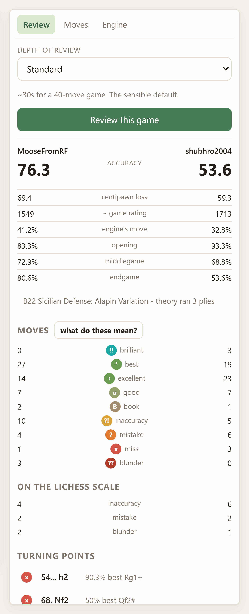
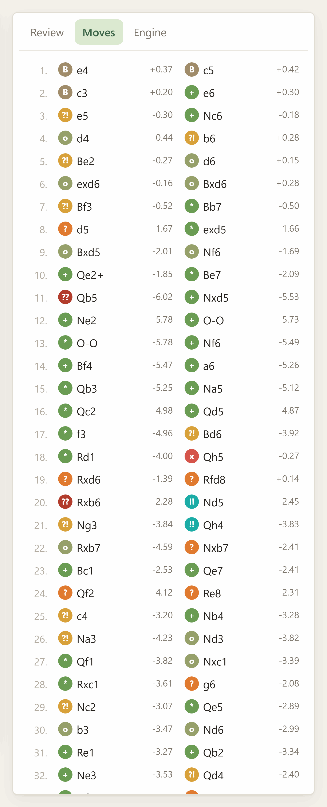
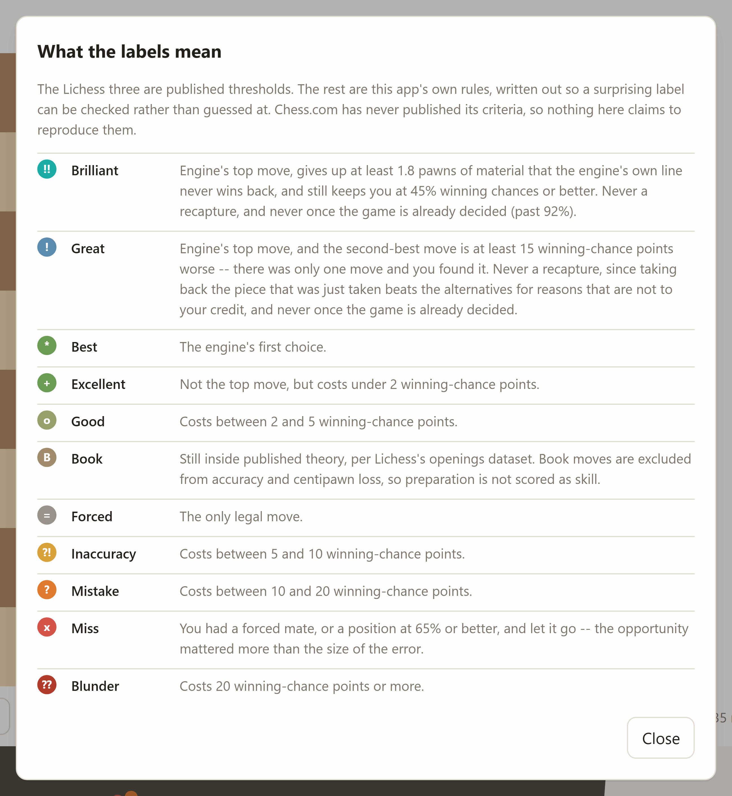
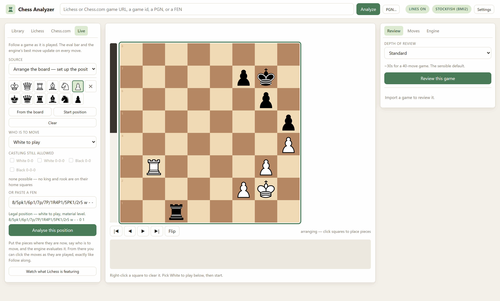
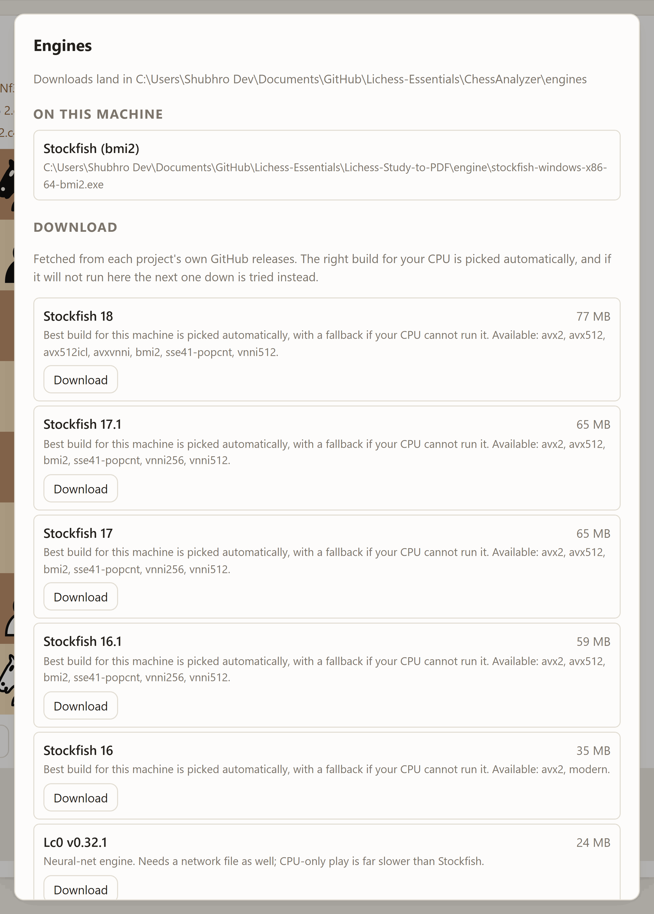

# Chess Analyzer

Review any chess game with an engine on your own machine — a Lichess game, a
Chess.com game, a PGN you pasted, or a position you typed. Accuracy, move
labels, an eval graph, the engine's best line at every point, and a live mode
that follows a game while it is still being played.

The two things it does that the sites do not: it works on **both** sites from
one place, and it tells you **why** it gave a move the label it gave it.

```powershell
cd ChessAnalyzer
& "..\.lichess\Scripts\python.exe" -m chess_analyzer.cli serve    # port 8779
```

Then open <http://127.0.0.1:8779>.


*Above: `54... h2`, the move this review calls the game's biggest turning point.
The strip over the board says `from the review`, so those three lines cost
nothing — the review already analysed this position to depth 44.*

---

## Getting a game in

One box takes all of these — it works out which is which by looking at them,
not by asking you:

| Paste this | What happens |
|---|---|
| `https://lichess.org/Wi8IPxc3` | Fetched from Lichess. Public API, no token. |
| `https://www.chess.com/game/live/146864147370` | Fetched from Chess.com, **including a game still in progress**. |
| A PGN, from anywhere | Read as-is. A `Site` tag saying lichess.org does not make it a link. |
| A FEN | Becomes a position you can analyse and play from. |
| A bare game id | 8 characters is Lichess, a long number is Chess.com. |

Or use the sidebar: type a username on the **Lichess** or **Chess.com** tab
and get their recent games with the PGN already attached, so opening one costs
no second request.

## The review

Pick a depth and press the button. Four presets, from ~10 seconds to a fixed
depth 22; a 90-ply game takes about 10 seconds on Quick and half a minute on
Standard.

<table>
<tr>
<td width="50%"></td>
<td width="50%"></td>
</tr>
<tr>
<td>The report. Two scales side by side, per-phase accuracy, and the turning points ranked by what they cost.</td>
<td>The move list. Every move wears its label, and the evaluation beside it is the one the review computed.</td>
</tr>
</table>

You get two scales side by side, on purpose:

**The Lichess scale** — inaccuracy, mistake, blunder at 10, 20 and 30
winning-chance points lost. Lichess publishes both these thresholds and the
accuracy formula, so the arithmetic here is theirs rather than an
approximation of it.

Checked against a game Lichess had already analysed
([Wi8IPxc3](https://lichess.org/Wi8IPxc3)), at the Deep preset:

| | this app | lichess.org |
|---|---|---|
| White accuracy | 76.3% | 76% |
| Black accuracy | 53.6% | 60% |
| White blunders | 2 | 6 |

Accuracy lands where it should. **The blunder counts do not, and will not** —
those depend on what the engine actually saw, and a different engine at a
different depth disagrees about which moves were losing. Treat the counts as
this engine's opinion, and the accuracy as comparable. Both apps agree about
the move that mattered: the app independently flagged `68. Nf2` as throwing
away a forced mate, which is what Lichess says about it too.

**The Chess.com-style ladder** — brilliant, great, best, book, excellent,
good, inaccuracy, mistake, miss, blunder. Chess.com has never published its
criteria, so this cannot be a reimplementation and does not pretend to be.
What it is: the same idea, built from rules that are **written down and shown
in the app** — click *what do these mean?* in the review panel. When a label
surprises you, you can read why it fired instead of guessing.



The rules that took the most tuning:

- **Brilliant** — the engine's top move, which gives up at least 1.8 pawns of
  material that the engine's own line never wins back, and still leaves you at
  45% or better. Material is read off the engine's principal variation four
  plies deep rather than from a hand-rolled exchange evaluator: if the engine's
  best play leaves you a piece down and still says you are fine, you sacrificed
  and it worked.
- **Great** — the top move, where the second-best is at least 15 points worse.
- Neither is ever given for a **recapture**, or once the game is decided past
  92%. Taking back the piece that was just taken beats the alternatives for
  reasons that are not to your credit; without that rule, a third of every game
  comes out "great".
- **Book** moves are excluded from accuracy and centipawn loss entirely, so
  preparation is not scored as skill.

Also in the report: per-phase accuracy (opening / middlegame / endgame, with
the boundaries found from the position rather than a fixed move number),
average centipawn loss, how often you found the engine's move, the turning
points ranked by what they cost, and a rough ACPL-implied rating shown with its
formula attached — it is a fit, not a measurement, and it moves 200 points on
one blunder.

## Reading it

- **The engine's ranked lines sit above the board**, in small text, and stay
  there while the **Lines** pill in the top bar is lit — they follow whatever
  position you are looking at rather than waiting to be asked. How many lines
  and how long the engine gets are on the *Engine* tab. Click one to play it.

  On a game you have reviewed these cost nothing: the review already analysed
  every position several variations deep, so scrolling through it shows those
  lines instantly, at the review's depth, and the strip says *from the review*
  so you know which they are. Only the final position, which the review has no
  row for, falls back to a live engine call.
- **The engine's preferred continuation sits beside the board controls**, as a
  score chip and the line. On a reviewed move it is deliberately retrospective
  — the line you could have played *instead* — because that is the question you
  are asking while reading a review. Anywhere else it is the best line from
  here.
- **Scroll the mouse wheel over the board** to step through the game — down
  goes forward, up goes back. Every position is already in the browser, so this
  is instant; it is the reason the board is drawn client-side rather than
  fetched as an image. Trackpads work too: deltas are accumulated to a
  threshold, so a flick is one move rather than ten. (The two sibling apps now
  do this as well.)
- Arrow keys do the same; `f` flips; `Home`/`End` jump to the ends.
- Click the eval graph to jump to that moment.
- Each move wears its label as a badge on the destination square, and when you
  did not play the engine's move, an arrow shows what it wanted.
- **Play any move on the board to explore.** The game itself is never touched:
  your move becomes a variation, shown in the move list in brackets and a
  lighter colour right after the move it replaces, the way Lichess and
  Chess.com do it — `5...O-O (5...d5 6.Bb5 Bg4)`. Keep playing and it extends;
  go back and try something else and you get a second variation beside the
  first; try something inside a variation and it nests in its own brackets.
  The engine follows you into them, so an exploratory move gets its own
  evaluation. *Back to the game* returns to the mainline, *Clear variations*
  throws them all away, and the review's labels and stored lines stay attached
  to the moves that were actually played.

## Live games

Five ways in, because the five situations are genuinely different.

| Mode | How it works |
|---|---|
| **Lichess** | A real push stream. `/api/stream/game/{id}` is public and sends a line per move — any game, yours or anyone's. Give it a game URL, an id, or just a username. |
| **Chess.com** | Polling `chess.com/callback/live/game/{id}` every two seconds and decoding the move list. **Undocumented** — see below. |
| **Follow along** | You click the moves as they are played. No network at all, so it works for a Chess.com blitz game, a stream you are watching, or a board in front of you. |
| **Arrange the board** | There is no URL and no PGN, only a position. Put the pieces where they are, say who is to move, and the engine evaluates it. See below. |
| **Paste PGN** | Paste, and re-paste as the game grows. Only ever moves forward: a short or scrambled paste cannot rewind the game. |

In every mode the eval bar and the engine's ranked lines keep up with the
current position, you can scroll back through the game without losing your
place when the players move, and **Save & review** freezes the game into the
library so you can run a full review on it.

### Arranging a position

Pick **Arrange the board** and the board becomes an editor, outlined in green
so it is obvious that clicking it no longer plays moves. Choose a piece from
the palette and click squares; clicking the piece that is already there
removes it, and right-clicking any square clears it. **From the board** copies
whatever position you are already looking at, which beats building from empty
when you only need to move two pieces.



*The castling row in that shot reads **none possible** on its own — no king and
rook are on their home squares in this position, so there is nothing to offer
and nothing left over from a previous arrangement to pass to the engine.*

Then say **White to play** or **Black to play**, and press *Analyse this
position*. From that point it behaves exactly like Follow along: the eval bar
and the engine's lines are live, and you click the moves as they happen.
**Save & review** turns it into a game in your library, with the arranged
position kept as the PGN's starting position.

Every click is validated, because most arrangements of pieces are not
positions. Two white kings, a pawn on the first rank, or Black in check while
White is to move cannot occur in a game, and an engine handed one either
refuses to start or produces a confident number about nothing. The editor says
which of those is wrong, in a sentence, before you can start.

Two details it fills in rather than asking about:

- **Castling rights** are offered only for a king and rook still on their home
  squares — and a tick left over from a previous arrangement is dropped rather
  than passed to the engine.
- **En passant** is offered only where a double pawn push could really just
  have happened *and* the capture would be legal. (python-chess's
  `has_legal_en_passant` is not enough on its own here: it asks whether a pawn
  could capture *onto* the square and will say yes when there is no pawn there
  to take. `status` is what checks a double push could have produced it. The
  editor needs both, or it would offer you a square its own validator then
  rejects.)

### The honest part about Chess.com live games

Chess.com's documented public API cannot see a live game. `/pub/player/{u}/games`
is documented as "games in progress" and returns **daily/correspondence games
only** — a blitz game you are playing right now is not in it, and no documented
endpoint has it.

`chess.com/callback/live/game/{id}` does have it. It is undocumented, which
means it is not covered by Chess.com's API terms and can change or vanish
without notice. This app therefore treats it as optional: if it stops
answering, the session keeps the moves it already has and tells you to switch
to Paste PGN, which always works.

That endpoint returns moves in **TCN**, Chess.com's own two-characters-per-ply
encoding, which nothing in python-chess speaks. The decoder in
[`tcn.py`](chess_analyzer/tcn.py) is verified against 40 real games that
Chess.com shipped as *both* TCN and PGN — every move and every final position
matches, promotions and en passant included. The fixture is in the repository
so the check runs with no network.

**Also**: Chess.com sits behind Cloudflare and returns a 403 challenge page to
any request without a `User-Agent` header. Not a rate limit and not a ban —
just a missing header, which is a confusing hour to spend if you do not know.

## Engines

The app uses whatever Stockfish it can find first — including the one in the
sibling app's `Lichess-Study-to-PDF/engine/` folder, so following this
repository's setup instructions means never being asked to download a second
copy.

Click the engine pill to see the picker. It reads each project's own GitHub
releases, so a new Stockfish appears the day it ships:



- **Stockfish**, any recent version (~77 MB).
- **Lc0** (~24 MB) plus a network file. The **Maia** networks are the
  interesting ones: they predict what a human *of a given rating* actually
  plays rather than what is best. Use one to ask whether a move was findable —
  never to judge one.

You can set the review engine and the analysis engine separately.

**About CPU builds.** Stockfish publishes one binary per instruction set —
`bmi2`, `avx2`, `avx512`, down to a plain `x86-64` — and running one your
processor cannot execute does not fail politely, it dies on an illegal
instruction. There is no portable way to read CPU feature flags from Python on
Windows, so the app does not guess: it downloads a build, **runs it**, waits
for it to answer `uci`, and on failure walks down to the next-safest build
automatically. What worked is remembered, so it happens at most once.

## What is kept on disk

`ChessAnalyzer/games/` holds one JSON file per imported game — the record, the
PGN and the finished review — plus `positions.json`, a shared cache of analysed
positions keyed by position **and** engine settings. That cache is why
re-reviewing a game at the same settings is instant, and why a 0.1-second
answer never masquerades as a depth-22 one.

`ChessAnalyzer/data/openings.json` is the opening index, built once from
Lichess's own openings dataset (3,810 named positions, no token needed). It is
indexed by position rather than by move order, so a transposition into a named
line is still recognised.

Downloaded engines go in `ChessAnalyzer/engines/`. All three directories are
gitignored.

A Lichess API token is accepted in Settings and is **never written to disk** —
it lives in the process and dies with it. Nothing here needs one; every
endpoint the app uses is public. It only raises the rate limit for bulk
imports.

## Command line

```bash
python -m chess_analyzer.cli serve                     # the browser interface
python -m chess_analyzer.cli review <url|id|pgn>       # review and print it
python -m chess_analyzer.cli review <url> --preset deep --depth 20
python -m chess_analyzer.cli engines                   # what is here, what is available
python -m chess_analyzer.cli engines --install stockfish:sf_18
python -m chess_analyzer.cli import <url>              # add to the library
python -m chess_analyzer.cli library                   # list saved games
```

## Tests

```bash
python -m pytest ChessAnalyzer/tests -q          # 51 tests
node ChessAnalyzer/tests/test_variations.js      # 10 more, if you have node
python ChessAnalyzer/tests/test_layout.py        # 21 in a real browser
```

No network and no engine required — a suite that needs both is a suite nobody
runs.

The second file covers the variation tree, which is browser code. Rather than
duplicating the logic, it lifts the functions out of the shipped `app.js` by
name and runs them against a `state` it controls; a copy would keep passing
after `app.js` changed underneath it, which is the one thing a test must not
do. (Checked by deliberately reintroducing the old behaviour, which failed
three of them.)

The third drives a real headless browser over the DevTools protocol, against a
server you have already started. It needs no new dependency — Edge or Chrome is
already on the machine and `websockets` came in with `uvicorn[standard]` — and
it skips if neither is there.

It exists because the app's worst bug could not be found by reading. The board
and the scrolling panel were resizing each other several times a second, so the
whole page shook; the stylesheet looked perfectly reasonable. One measurement
found it. It now checks that the board, the controls and the graph fit at seven
window sizes, that the board's size *settles* rather than drifting, that an
arriving evaluation does not move it, that trying a move leaves the game's
notation alone, and that a wheel notch and a trackpad flick each move exactly
one move.

## Things worth knowing if you change this

**A warm engine stops the process from exiting.** python-chess runs each
engine's event loop on a *non-daemon* thread, and CPython joins non-daemon
threads *before* it runs `atexit` handlers. So a program that leaves an engine
open prints its last line and then blocks for ever, with no output and no
traceback to explain it. An `atexit` hook does not fix this — it runs too late.
Every entry point must call `engines.close()`; the server does it in its
shutdown handler and the CLI in a `finally`.

**Lichess's single-game export is not under `/api`.** It is
`https://lichess.org/game/export/{id}`, while everything else this app uses is
`https://lichess.org/api/...`. Getting it wrong returns a 404 HTML page.

**The opening explorer needs a token; the openings dataset does not.**
`explorer.lichess.org` now requires an authenticated request, which is why book
detection here uses the downloadable dataset instead — it never changes, so a
380 KB download once beats an authenticated request per position.

**Scores are White's point of view everywhere**, matching `PovScore.white()`
and the sibling app's `Eval`. Only `classify.py` flips, and it does so once, at
the boundary. A 30-point drop in White's winning chances is a *gain* for Black,
and there is a test that keeps that sign honest.

## Hosting it for free

Same profile as
[the other two apps](../Lichess-Study-to-PDF/README.md#hosting-it-for-free) —
FastAPI/Uvicorn needing a real container, not a serverless host. Unlike
Repertoire-Creator, this app doesn't actually import the sibling package
anywhere in its code despite the `cloud` extra in `pyproject.toml` (that's an
unused hook for later), so [`Dockerfile`](Dockerfile) is self-contained in
this folder — no repo-root build context needed.

It installs Stockfish via `apt-get` rather than letting the app's own
GitHub-releases downloader (`chess_analyzer/engines.py`) fetch one at
runtime — simpler, and `apt` already picks the build matching the container's
actual CPU. `engines.py` checks `$STOCKFISH_PATH` directly
([engines.py:214](chess_analyzer/engines.py#L214)), which the Dockerfile
sets, so it shows up in the engine picker as "Engine from $STOCKFISH_PATH"
with nothing else to configure. Lc0/Maia are left out — they're optional, and
downloadable from the same picker at runtime if you want them.

### What does *not* persist on a free host

`games/`, `data/openings.json` and `engines/` are already gitignored locally
because they're regenerated on demand (see "What is kept on disk", above) —
but on a free container they also get wiped by every redeploy, and possibly
every wake from sleep. Unlike Repertoire-Creator, there is no git-autosave
here to fix that. In practice that means: the openings index rebuilds itself
on first use, Stockfish is already baked into the image so there's nothing to
re-download for the main engine, and **your reviewed-game library does not
survive a restart**. Treat a hosted instance as a live analysis tool, not a
permanent archive — export or note anything from `games/` you want to keep,
or do that curation against a local run instead.

### Render

1. Push this repo to GitHub.
2. **New Web Service** → connect the repo → **Root Directory**:
   `ChessAnalyzer` → Render auto-detects the Dockerfile → **Free** instance.
3. Optional environment variables, marked **secret**: `ANALYZER_AUTH_USER` /
   `ANALYZER_AUTH_PASS` — see "Locking it behind a password" below.
4. Deploy. You get a URL like `https://<name>.onrender.com`.

### Hugging Face Spaces

Spaces are their own separate git repo, so:

1. **New Space** → **SDK: Docker** → **Hardware: CPU basic (free)**.
2. Clone the Space's repo locally, then copy this folder's **contents**
   (`Dockerfile`, `requirements.txt`, `chess_analyzer/`, etc.) into its
   root — not the `ChessAnalyzer` folder itself, what's inside it.
3. Add this to the top of the Space's `README.md`:
   ```yaml
   ---
   title: Chess Analyzer
   sdk: docker
   app_port: 7860
   ---
   ```
4. **Settings → Repository secrets**: `ANALYZER_AUTH_USER` /
   `ANALYZER_AUTH_PASS`, if you want the password gate below.
5. Commit and push (a Hugging Face access token as the git password).

### Locking it behind a password

[`server.py`](chess_analyzer/server.py) already has an HTTP Basic Auth gate
that only activates when both `ANALYZER_AUTH_USER` and `ANALYZER_AUTH_PASS`
are set — leave them unset and local `chess-analyzer serve` is unaffected.
Set both as secrets on whichever host you use and every route, API included,
asks for that username and password first. It's one shared credential pair,
not per-user accounts, sent over the HTTPS both Render and Hugging Face
Spaces terminate by default.

### One less thing to worry about here

This app never asks for a Lichess token via an environment variable at all —
the token field in Settings lives in memory only and every endpoint it calls
is public (see "What is kept on disk", above). The public-token caveat that
applies to the other two apps' `LICHESS_TOKEN` doesn't apply here.

## Licence

MIT — see [LICENSE](../LICENSE).
