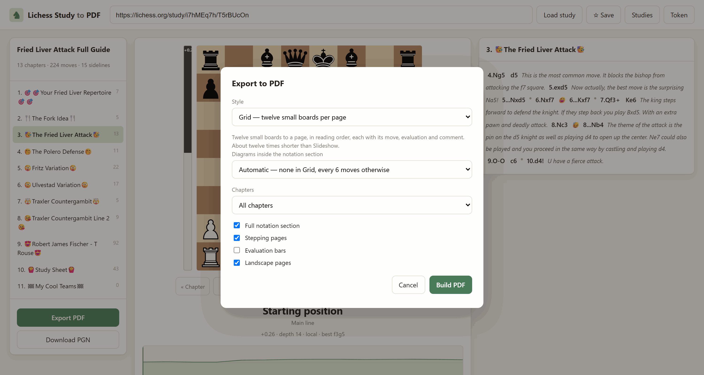
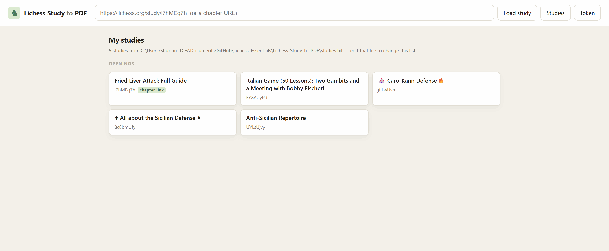
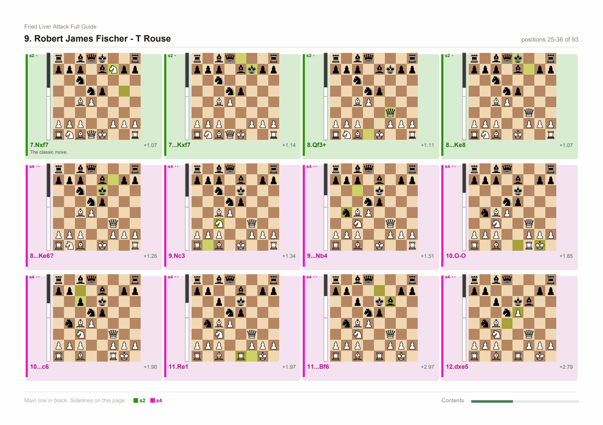
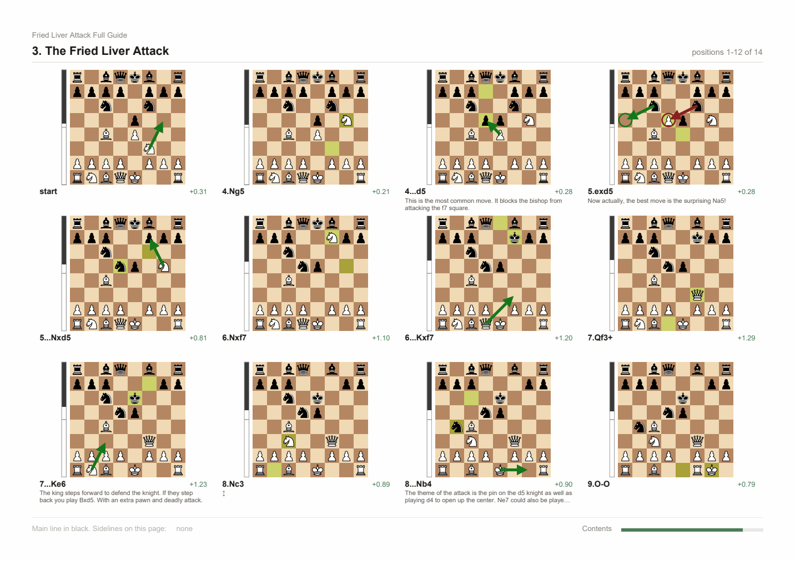
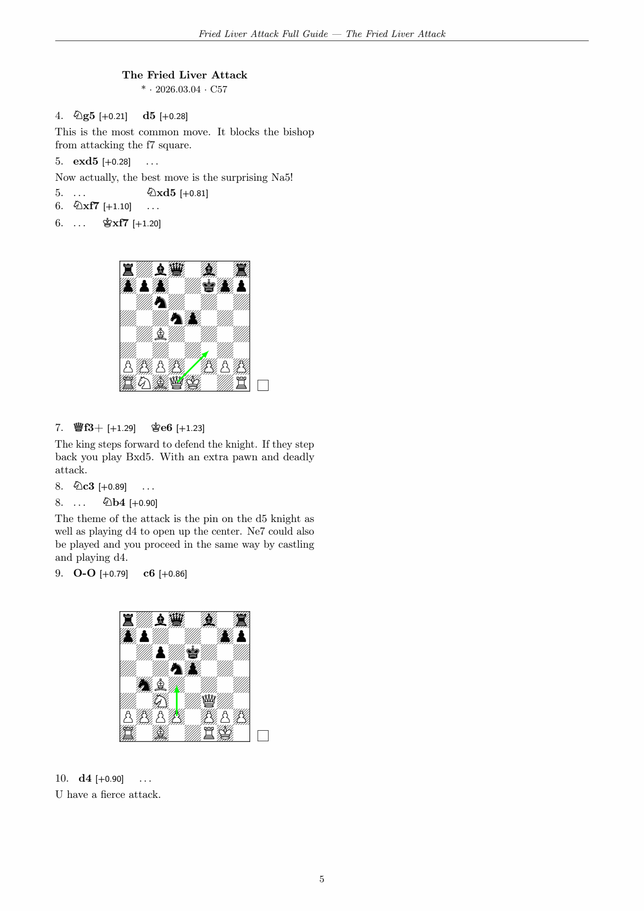

# Lichess Study to PDF

Turn a Lichess study into a PDF worth reading, plus a browser interface for
working through it first.

Everything in the study makes it into the export: main line, sidelines nested
to any depth, comments, NAG symbols (`!`, `?!`, `□`), and the coloured square
markers and arrows Lichess stores in the PGN.


---

## Running the app

### Step 1 — set up, once

The virtualenv lives at the **repository root**, one level above this folder,
and is shared by every app in the repo.

<details open>
<summary><b>Windows (PowerShell)</b></summary>

```powershell
cd "C:\Users\<you>\Documents\GitHub\Lichess-Essentials"
python -m venv .lichess
.\.lichess\Scripts\python.exe -m pip install -r Lichess-Study-to-PDF\requirements.txt
```
</details>

<details>
<summary><b>Windows (Git Bash) / macOS / Linux</b></summary>

```bash
cd ~/Documents/GitHub/Lichess-Essentials
python -m venv .lichess

# Git Bash on Windows
./.lichess/Scripts/python.exe -m pip install -r Lichess-Study-to-PDF/requirements.txt

# macOS / Linux
./.lichess/bin/python -m pip install -r Lichess-Study-to-PDF/requirements.txt
```
</details>

You only ever do this once.

### Step 2 — start the web app

**Run it from inside the `Lichess-Study-to-PDF` folder** — that is where the
`lichess_study_pdf` package lives, and Python needs to see it.

```powershell
# Windows PowerShell
cd "C:\Users\<you>\Documents\GitHub\Lichess-Essentials\Lichess-Study-to-PDF"
& "..\.lichess\Scripts\python.exe" -m lichess_study_pdf.cli serve
```

```bash
# Git Bash on Windows
cd ~/Documents/GitHub/Lichess-Essentials/Lichess-Study-to-PDF
../.lichess/Scripts/python.exe -m lichess_study_pdf.cli serve

# macOS / Linux
cd ~/Documents/GitHub/Lichess-Essentials/Lichess-Study-to-PDF
../.lichess/bin/python -m lichess_study_pdf.cli serve
```

You should see:

```
  Lichess Study to PDF is running.
  Open http://127.0.0.1:8777 in your browser.
    engine : ...\engine\stockfish-windows-x86-64-bmi2.exe
    LaTeX  : ...\MiKTeX\miktex\bin\x64\pdflatex.EXE
  Press Ctrl+C to stop.
```

Those two lines tell you what will work: no engine means blank eval bars, no
LaTeX means the book mode is greyed out. Neither stops the app running.

### Step 3 — use it

1. Open <http://127.0.0.1:8777>. It opens on **My studies** — your own list
   of studies as clickable cards, named, so you can see what you are opening.
   See [Your studies list](#your-studies-list) below.
2. Click one, or paste a study URL and press **Load study**.
   For a **private** study, paste a *chapter* URL
   (`https://lichess.org/study/i7hMEq7h/0KOpBPyc`) — every other chapter is
   found automatically, no token needed. See the next section.
3. Click chapters on the left; step through with **Space**, the arrow keys, or
   by **scrolling the mouse wheel over the board** — down goes forward, up goes
   back, and either one stops the autoplay.
   Click any move — including inside a sideline — to jump there.
   Pick up a piece to play your own moves from that position.
4. **Export PDF** on the bottom left, choose a style, **Build PDF**.



Handy: `http://127.0.0.1:8777/?url=<study-url>` loads a study straight away,
so you can bookmark a study you open often.

### Your studies list



The home page is built from **`studies.txt`**, in this folder. One study per
line:

```text
## Openings
Fried Liver Attack Full Guide | https://lichess.org/study/i7hMEq7h/T5rBUcOn
Anti-Sicilian Repertoire | https://lichess.org/study/UYLsUjvy
https://lichess.org/study/EY8AUyPd
```

- `Name | URL` — the name is what the card says, the URL is what it opens.
- The name is optional: a bare URL works, the card just shows the study id.
- `## Something` starts a section, `#` starts a comment, blank lines are
  ignored.
- A line that is neither a comment nor a study is reported under the list
  rather than throwing the rest of it away, so one typo costs you nothing.
- Put a **chapter** URL in for a private study, as the Fried Liver line does:
  that is what lets it open without a token.

Two ways to add to it:

- **Edit the file.** The page re-reads it on every refresh — no restart.
- **Press ☆ Save** in the header while a study is open. It appends the study
  under a `## Saved from the app` section with its real name filled in.
  Saving one twice does nothing.

`LICHESS_STUDIES_FILE=/some/other/path.txt` points the app at a different
list, if you would rather keep yours outside the repository.

There is no Lichess API for the studies you have *liked*, so the list cannot
be filled from your Lichess favourites automatically. What Lichess does expose
is every study belonging to an account (`/api/study/by/<username>`), so a list
of your own studies can be generated if you want one.

### Step 4 — stop it

`Ctrl+C` in the terminal you started it in.

### Other ports

```bash
... cli serve --port 8899            # if 8777 is taken
... cli serve --host 0.0.0.0         # reachable from other devices on your LAN
```

`--host 0.0.0.0` exposes the app to your whole network and there is no
authentication — only do it on a network you trust.

---

## Without the browser: straight to a PDF

Same folder, same interpreter, no server involved:

```bash
cd Lichess-Study-to-PDF

# the default: twelve small boards to a page
../.lichess/Scripts/python.exe -m lichess_study_pdf.cli \
    "https://lichess.org/study/i7hMEq7h/0KOpBPyc" -o repertoire.pdf

# a typeset chess book
../.lichess/Scripts/python.exe -m lichess_study_pdf.cli \
    "https://lichess.org/study/i7hMEq7h/0KOpBPyc" --mode book -o book.pdf

# one big board per page, steps with the arrow keys
../.lichess/Scripts/python.exe -m lichess_study_pdf.cli \
    "https://lichess.org/study/ByhlXnmM" --mode slideshow -o study.pdf

# what engine did it find?
../.lichess/Scripts/python.exe -m lichess_study_pdf.cli engine-info
```

Full option list: `... cli export --help`, or the CLI reference further down.

---

## If something goes wrong

| Symptom | Cause and fix |
|---|---|
| `No module named lichess_study_pdf` | You are in the wrong directory. `cd` into `Lichess-Study-to-PDF` first. |
| `Port 8777 is already in use` | The app is probably already running — open the browser, or `--port 8899`. |
| `No module named 'chess'` (or `fastapi`, `reportlab`, …) | You ran the system Python instead of the venv one. Use the full `..\.lichess\Scripts\python.exe` path. |
| Eval bars are blank | No Stockfish. Run `engine-info` and drop a binary in `engine/`. |
| Book mode greyed out | No `pdflatex`. Install MiKTeX or TeX Live, or use Slideshow. |
| `403 ... study is private` | Paste a **chapter** URL instead of the study URL, or supply a token. |
| PDF looks blank except the first position of each chapter | You exported in **Acrobat** mode. Re-export as Book or Slideshow. |

---

## Private studies work without a token

Lichess is inconsistent about study privacy, and this tool exploits that:

```
GET /api/study/<study>.pgn            -> 403 for a private study
GET /api/study/<study>/<chapter>.pgn  -> 200, full PGN, no token
```

The per-chapter endpoint does not enforce the study's privacy. So **paste a
chapter URL** and the whole study comes down:

```
https://lichess.org/study/i7hMEq7h            <- 403, private
https://lichess.org/study/i7hMEq7h/0KOpBPyc   <- works, and finds the other 12
                                                 chapters automatically
```

The chapter's own page lists every chapter in the study, so one chapter URL is
enough to rebuild all of it. Open your study on Lichess, click any chapter,
copy that address.

A token is still supported and is the documented route — create one with the
`study:read` scope at
<https://lichess.org/account/oauth/token/create?scopes[]=study:read>, then
`--token`, `LICHESS_TOKEN`, or `~/.lichess_token`.

---

## The four export styles

Every chapter starts on a fresh page in all of them, and every sideline is
given its own colour, so two alternatives to the same move never look alike.

Each colour arrives in three matching tones: a **bar** down the left edge of
the board or notation block, a mild **wash** behind it, and the **ink** of its
moves. Numbering is chapter-wide — a branch point hands its alternatives a
consecutive run of colours (which the palette spaces ~105° apart on the wheel),
and a sideline nested inside another gets one of its own, so nothing that a
reader sees at once shares a colour. The palette holds 24; after that colours
repeat, which only ever affects sidelines pages apart.

Every sideline also carries its number — `s1`, `s2`, … printed where it opens,
in the grid cell, in the breadcrumb — so the colour has a name. That, the bar,
the indent and the depth dots are all shape rather than hue, which is what
keeps nesting and identity readable in a greyscale print or for a colour-blind
reader. Grid pages carry a legend of the sidelines shown on them along the
footer.



### `--mode grid` (default) — twelve boards to a page

A contact sheet: every position gets its own diagram, twelve to a page, in
reading order, each with its move, evaluation and comment underneath. Same
coverage as the slideshow with a twelfth of the diagram pages — measured on a
237-position study, 20 pages instead of 237.



Comments are trimmed to two lines in a grid cell; the notation section, which
is on by default, still carries every comment in full.

Two things that make a page hold fewer than twelve:

* **Short chapters.** Chapters always start on a fresh page, so a chapter with
  six positions gets a page with six boards. That is the direct cost of the
  one-chapter-per-page rule.
* **The notation section.** It is a separate, text-only section — it does not
  put boards on its pages in grid mode, because the grid already shows every
  position. `--no-notation` drops it entirely if you only want diagrams.

`--diagrams` controls diagrams *inside the notation section* only, never the
grid. It defaults to automatic: `none` in grid mode, `every:6` elsewhere.

```
--grid-columns 4 --grid-rows 3     # the default 12 per page
--grid-columns 3 --grid-rows 2     # 6 bigger boards per page
```

### `--mode book` — a typeset chess book

Compiled with LaTeX (`xskak` + `chessboard`): portrait, two columns,
justified Computer Modern, figurine notation (`♘f3`), printed-book diagrams
with hatched squares and a side-to-move marker, arrows and circles from the
study's own annotations, and optional `[+0.42]` evaluations beside each move.

A 13-chapter study lands in about 16 pages. This is the mode to use for
reading and printing.



Needs `pdflatex` (MiKTeX or TeX Live) with `xskak`, `chessboard`, `skak`.
Without it the mode is disabled in the UI and the CLI says so.

### `--mode slideshow` — one big board per page

One position per page, so your reader's ordinary next-page key — space,
arrow, PageDown, a presentation remote, a tap on a phone — steps the board
forward one move. No scripting, so it behaves identically in every viewer.

Each page carries the board, the eval bar, the current line with the move
boxed, upcoming moves greyed ahead of it, and the comment. It is long by
nature — use `grid` unless you specifically want to step move by move.

### `--mode acrobat` — layered, Adobe Reader only

Each chapter is a single page holding every position as a PDF optional-content
layer, switched by embedded JavaScript.

**Only Adobe Acrobat Reader executes PDF JavaScript.** Everywhere else you see
the first position of each chapter and the buttons do nothing. The file now
carries a full-page warning saying exactly that, because this mode is easy to
pick by accident and the result looks broken rather than limited.

---

## Evaluation bars

Two sources, in order:

1. **Lichess cloud eval** — instant, but only for positions already in its
   cache (in practice, openings), and **firmly rate limited**: a few hundred
   lookups earns a `429` that lasts minutes. So the cloud is only asked about
   positions up to move 20, paced about a second apart, and a `429` is
   recorded and skipped rather than waited on. It never blocks the UI.
2. **Local Stockfish** — full coverage, and what actually evaluates a personal
   repertoire.

Put a Stockfish binary in `engine/`, on `PATH`, or at `$STOCKFISH_PATH`;
`engine-info` tells you what it found. Results are cached in
`~/.cache/lichess-study-pdf/evals.json`, keyed so cloud results are reused
regardless of engine settings.

**Export evaluations are computed on the server** for every position being
exported. Earlier versions shipped whatever the browser happened to have,
which meant most positions came out blank — that is fixed. Expect roughly
30 s for a 240-position study.

---

## The web interface

Modelled on [chesspaper.me](https://chesspaper.me/), with the gaps filled in:

| | chesspaper.me | this |
|---|---|---|
| Sidelines and comments | need per-node toggling | all visible from the start |
| Board stepping | no next control | **Space / arrow keys / Next button** |
| Which line you step | — | follows whichever line you clicked into |
| Eval bar | — | live for the position you are on, ~150 ms |
| Play your own moves | — | pick any piece up, from any position |
| Diagrams in the PDF | manual toggle per node | one setting for the whole study |

**Free play.** Click a piece and its legal moves light up; click a destination
and you are off the study line, with a banner telling you how many moves deep
you are and a button back. Evaluations keep coming for every move you invent.
Left arrow takes back, Escape returns to the line. Legality is checked
server-side by python-chess, so there is no chess library in the browser.

**Hover preview.** Hovering any move in the notation pops up a small board of
that position, so you can scan a sideline without leaving where you are.

Keyboard: `Space`/`→`/`↓` next, `←`/`↑` back, `Home`/`End` first/last,
`F` flip, `P` autoplay, `Esc` cancel selection or leave free play.

---

## CLI reference

```
lichess-study-pdf <study-url|chapter-url> [options]

  -o, --output PATH      output file
      --token TOKEN      Lichess API token (study:read)
      --pgn FILE         read a local PGN instead of calling the API
      --chapter-only     with a chapter URL, export only that chapter
      --save-pgn FILE    also save the downloaded PGN

      --mode MODE        grid (default) | book | slideshow | acrobat
      --grid-columns N   boards across the page in grid mode (default 4)
      --grid-rows N      boards down the page in grid mode (default 3)
      --latex PATH       pdflatex binary for --mode book
      --keep-tex PATH    also write the generated .tex
      --no-notation      skip the read-through notation section
      --no-steps         skip the one-page-per-position section
      --chapters SPEC    subset, 1-based, e.g. 1,3,5-8
      --max-depth N      drop sidelines nested deeper than N
      --diagrams POLICY  none | comments | all | every:N   (default every:6)
      --page-size SIZE   a4 | a3 | letter
      --portrait         portrait pages (book mode is always portrait)

      --no-evals         no evaluation bars
      --no-cloud         engine only, skip the Lichess cloud
      --engine PATH      Stockfish binary
      --movetime SEC     seconds per position (default 0.25)
      --depth N          fixed depth instead of a time budget

lichess-study-pdf serve [--host H] [--port P]
lichess-study-pdf engine-info
```

---

## Hosting it for free

This is a plain FastAPI/Uvicorn app with one runtime dependency worth caring
about: Stockfish, invoked as a subprocess and kept warm for the life of the
process ([server.py](lichess_study_pdf/server.py)). That rules out anything
serverless (Vercel, AWS Lambda-style hosts) — you need something that runs a
real, long-lived container. Two that do it for free:

| | Hugging Face Spaces | Render.com |
|---|---|---|
| Cost | Free, no card required | Free tier — check current signup terms, this has changed before |
| Runtime | Docker | Docker |
| Idle behaviour | Sleeps, wakes on the next visit | Spins down after ~15 min idle; cold start on the next request |

[`Dockerfile`](Dockerfile) in this folder installs Stockfish via `apt-get`
(Debian's package, not a manual binary download) and deliberately skips
LaTeX — a full texlive install is several GB and not worth it unless you
specifically want book mode. It sets `STOCKFISH_PATH` to the apt package's
install location so `find_stockfish()` finds it without relying on `PATH`.

### Render

1. Push this repo to GitHub.
2. **New Web Service** → connect the repo → **Root Directory**:
   `Lichess-Study-to-PDF` → Render auto-detects the Dockerfile → **Free**
   instance type → deploy.
3. You get a URL like `https://<name>.onrender.com`.

### Hugging Face Spaces

Spaces are their own separate git repo (not this GitHub repo), so:

1. **New Space** → **SDK: Docker** → **Hardware: CPU basic (free)**.
2. Clone the Space's repo locally, then copy this folder's **contents**
   (`Dockerfile`, `requirements.txt`, `lichess_study_pdf/`, etc.) into its
   root — not the `Lichess-Study-to-PDF` folder itself, what's inside it.
3. Add this to the top of the Space's `README.md`:
   ```yaml
   ---
   title: Lichess Study to PDF
   sdk: docker
   app_port: 7860
   ---
   ```
4. Commit and push (a Hugging Face access token as the git password).

### Before you make it public

- **Don't set `LICHESS_TOKEN` on a public deployment.** It would be shared by
  every visitor — anyone with the URL could pull whatever private studies
  that token can see. Leave it unset; paste a token into the UI per session
  instead, the same as running it locally.
- There is no password wall here by default — anyone with the link can use
  the tool (not access your Lichess account, just use the app). If you want
  one, the sibling app has it wired up — see
  [Repertoire Creator's hosting section](../Repertoire-Creator/README.md#hosting-it-for-free)
  for the pattern; it is not implemented in this app.

---

## Layout

```
lichess_study_pdf/
  fetch.py         URL -> PGN, token handling, private-study chapter fallback
  parse.py         PGN -> chapters -> depth-first list of positions
  notation.py      notation blocks and move-tree helpers
  render.py        board SVG -> vector drawing, eval bar
  fonts.py         Unicode font resolution (□ ± ∞ would break Helvetica)
  pdf.py           grid + slideshow writers, title/contents/notation
  pdf_latex.py     the LaTeX chess book
  pdf_acrobat.py   optional-content layers + embedded JavaScript
  evals.py         cloud eval, Stockfish, non-blocking back-off, disk cache
  cli.py           command line
  server.py        FastAPI backend, warm engine singleton
  web/             browser interface (no build step, plain JS)
```

`../.lichess/Scripts/python -m pytest tests -q` runs the suite. The test that
matters most replays every position's recorded line and asserts it reaches
that position's FEN — that is what guarantees no sideline is misattached.

## Licence

MIT. Chess piece artwork in the SVG boards comes from python-chess (Colin
M.L. Burnett's Cburnett set, CC BY-SA 3.0); the book mode's diagrams come from
the LaTeX `chessboard` package.
