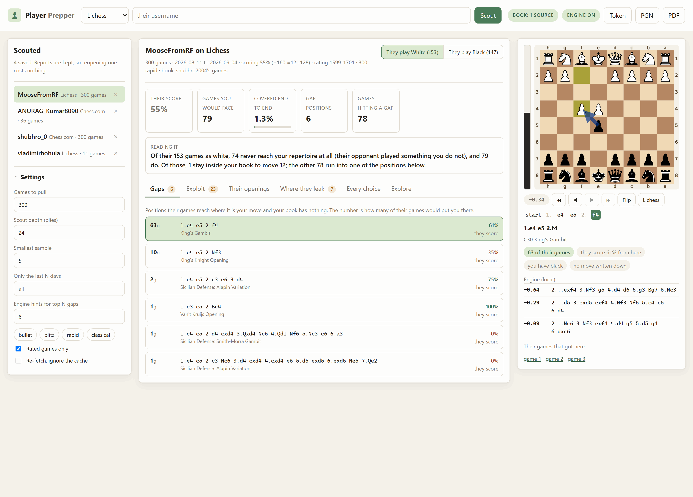
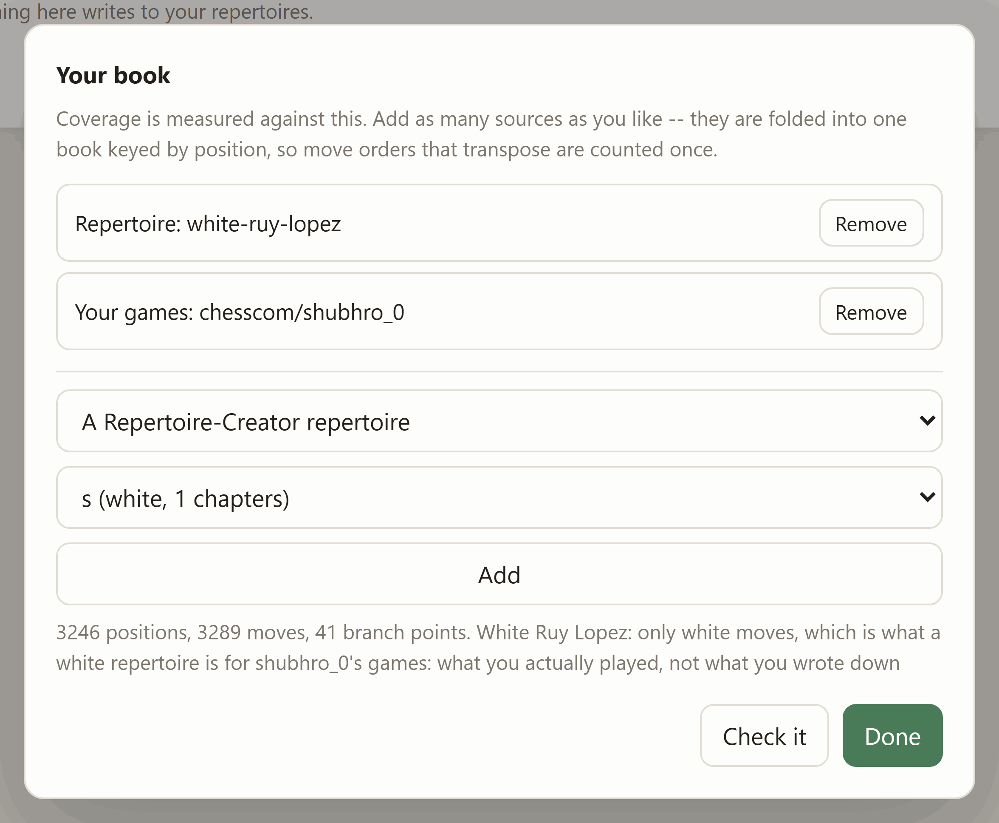
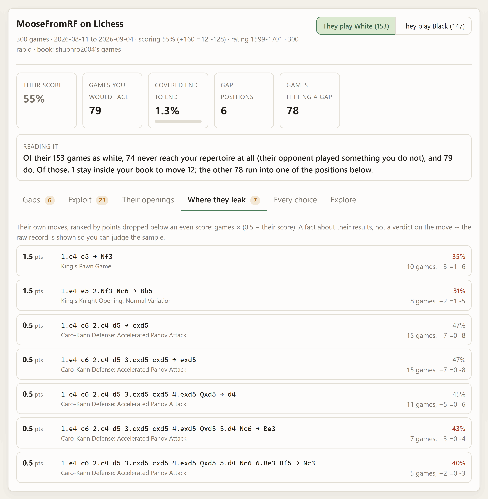
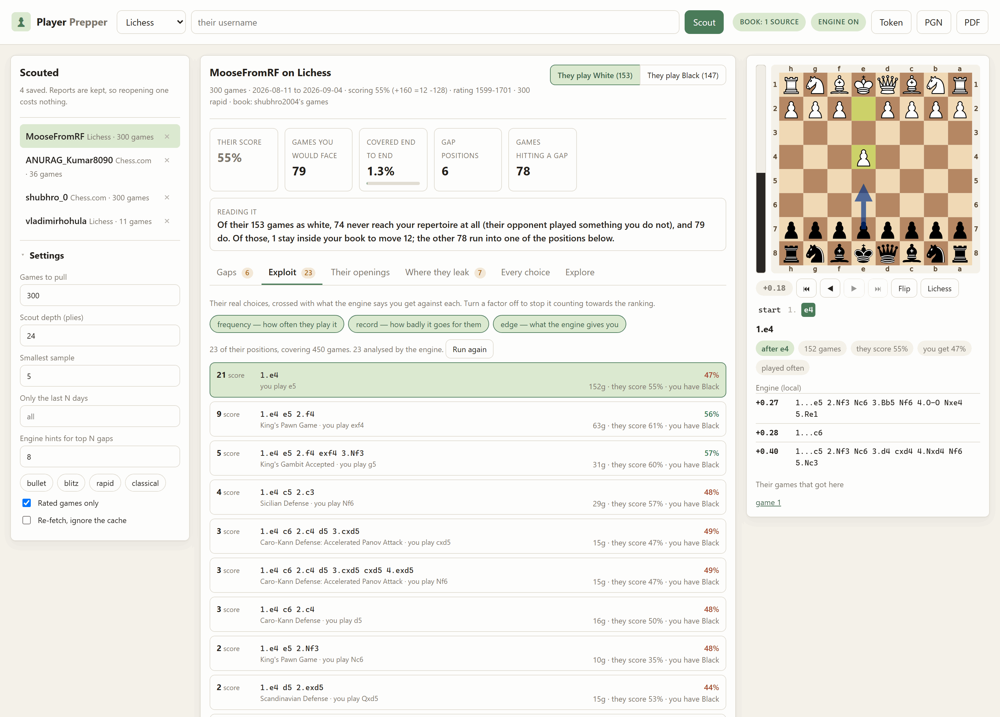
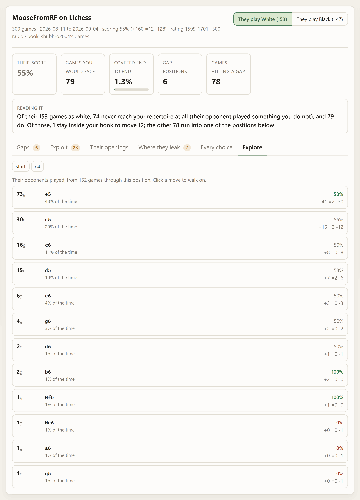
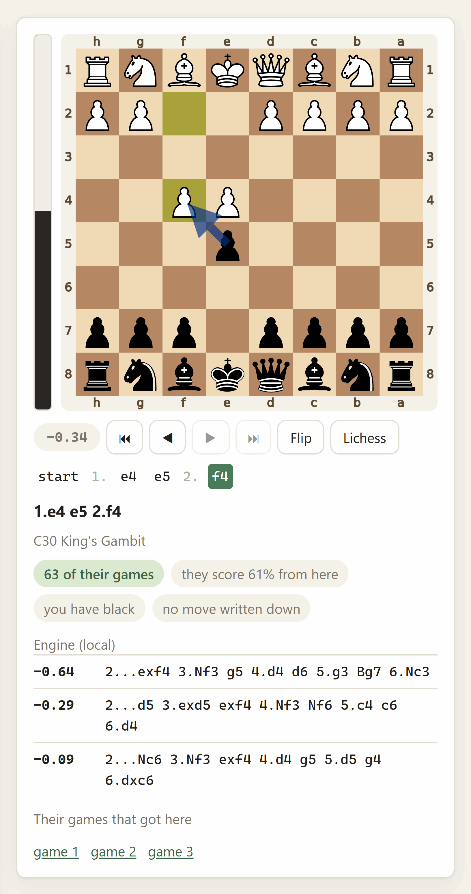
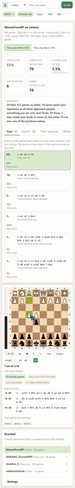
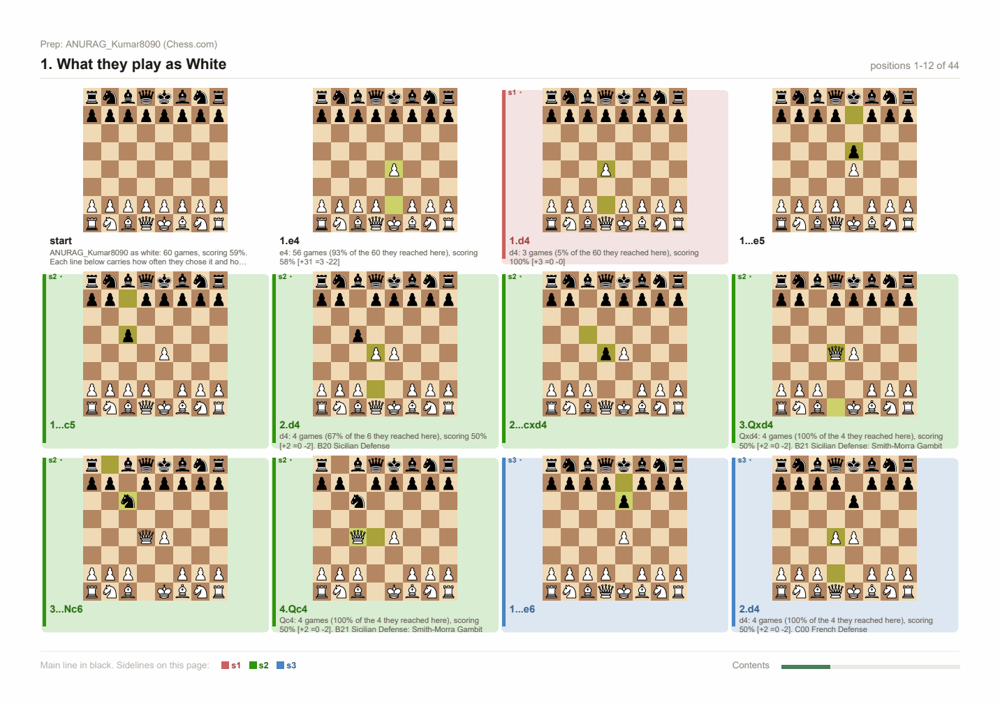

# Player Prepper

Scout an opponent from their own games, and find out what you have no answer
for.

Give it a Lichess or Chess.com username. It pulls a few hundred of their
games, folds them into an opening tree keyed by position, and answers three
questions:

- **What do they play?** Per colour, counted, named, with how they score.
- **Where do they leak points?** Their own results, ranked by how many points
  a move has actually cost them. No engine, no opinion.
- **What have you got nothing for?** Every position their games reach where it
  is *your* move and your book is empty — weighted by how many of their games
  would put you there.
- **Where should you aim?** Their real choices crossed with what the engine
  says you get against each, ranked by an opportunity score you control.

That third one is the whole product, and it needs to know what you play. It
can read that from a Repertoire-Creator repertoire, a Lichess study, or your
own games — or all three at once.

```powershell
cd Player-Prepper
& "..\.lichess\Scripts\python.exe" -m player_prepper.cli serve    # port 8780
```

Then open <http://127.0.0.1:8780>.



*Above: this opponent meets 1.e4 with the Scandinavian in 30 of their 60 games
as Black, and the repertoire being measured has no move written down for it.*

---

## What a gap actually is

A gap is not "a position you have not studied" — there are billions of those.
It is a position that

1. **this opponent actually steers into**, in games they really played,
2. **your own repertoire actually reaches**, so it is a line you will get, and
3. **you have written nothing about**.

The count beside it is the number of their games that would have put you
there. That is the number worth working through in order.

Getting there means walking each of their games ply by ply, up to the scouting
depth, and doing one of three things at every one of your turns:

| At your turn | |
|---|---|
| Your book has a move, and they played into it | Carry on. |
| Your book has a move, and the game went somewhere else | **Drop the game.** Their real opponent played something you never would, so this game is about somebody else's repertoire. Counting it would punish you for a line you cannot reach. |
| Your book has nothing here | **A gap.** Record the position, stop the game, and add one to that position's count. |

Their own moves are never checked against anything — whatever they played, you
have to meet it.

So a colour's coverage comes out as three numbers that add up:

```
their 60 games as Black
  = 18 that never reach your repertoire   (their opponent opened 1.d4; you play 1.e4)
  + 42 that do
      = 0 that stay inside it to move 12
      + 42 that run into one of 6 gap positions
```

The middle number is the honest denominator. A tool that measured coverage
against all 60 would report 70% "coverage" for a repertoire that answers
nothing, purely because most of their games were unreachable.

---

## Setting up

Everything shares the one virtualenv at the repository root. From the
repository root:

```powershell
# Windows PowerShell
python -m venv .lichess
.\.lichess\Scripts\python.exe -m pip install -r Player-Prepper\requirements.txt
.\.lichess\Scripts\python.exe -m pip install -e Lichess-Study-to-PDF
```

```bash
# Git Bash on Windows
python -m venv .lichess
./.lichess/Scripts/python.exe -m pip install -r Player-Prepper/requirements.txt
./.lichess/Scripts/python.exe -m pip install -e Lichess-Study-to-PDF

# macOS / Linux
python -m venv .lichess
./.lichess/bin/python -m pip install -r Player-Prepper/requirements.txt
./.lichess/bin/python -m pip install -e Lichess-Study-to-PDF
```

That second install is the sibling app, and it is **optional**. Without it the
app still scouts, still measures coverage and still lists every gap; what you
lose is the engine's suggestion for a gap, the PDF export, and the ability to
read a *private* study as your book. The startup banner tells you which of
those are available.

A [Stockfish](https://stockfishchess.org/download/) binary in
`Lichess-Study-to-PDF/engine/` is what turns on the engine suggestions. A LaTeX
install (MiKTeX or TeX Live) unlocks the typeset book layout for the PDF.

**No API token is needed.** Every endpoint this app uses is public. A Lichess
token raises the rate limit when you are pulling hundreds of games, and lets a
private study be used as your book — paste one into the Token dialog and it is
kept in memory for that session only, never written to disk.

## Running it

```powershell
# Windows PowerShell
cd Player-Prepper
& "..\.lichess\Scripts\python.exe" -m player_prepper.cli serve
```

```bash
# Git Bash on Windows
cd Player-Prepper
../.lichess/Scripts/python.exe -m player_prepper.cli serve

# macOS / Linux
cd Player-Prepper
../.lichess/bin/python -m player_prepper.cli serve
```

Open <http://127.0.0.1:8780>. `Ctrl+C` stops it. `--port 8781` if 8780 is
taken; `--host 0.0.0.0` exposes it to your network, which has no
authentication unless you set the password gate below — only do that on a
network you trust.

---

## Your book: the three sources

Coverage is measured against a **book**, which is `{position: moves you play
from it}` — the same shape as Repertoire-Creator's universal mode, and for the
same reason. Keying on the position rather than the line is what makes a scout
survive move orders: if their pet order transposes into a normal Sicilian, a
line-keyed book would call it uncovered and simply be wrong.

Click the **book** pill in the top bar. You can stack as many sources as you
like; they fold into one book.

| Source | |
|---|---|
| **A Repertoire-Creator repertoire** | Read straight off `Repertoire-Creator/repertoires/`. That folder is plain PGN plus a small JSON manifest, so this reads the files rather than importing the app — the two never have to be installed together. Set `REPERTOIRE_DIR` if yours live elsewhere; it is the same variable the sibling app honours. |
| **A Lichess study** | Paste a study or chapter URL. With the sibling exporter installed, private studies work through its chapter-by-chapter route with no token. Without it, public studies still work. |
| **Your own games** | What you actually play, as opposed to what you wrote down. Only your moves are recorded, and how often you played each, so the book knows your main move from something you tried once. |

**Only your side's moves are ever recorded.** A white repertoire lists Black's
tries too, and counting those as your own answers would report coverage you do
not have — so a repertoire contributes only moves made by the colour it is
for, and a book built from your games contributes only the moves *you* made.

Colour is never stored, because it does not need to be: a move recorded from a
position where White is to move *is* a white move. Coverage asks about one
colour at a time and looks at whose turn it is.

The one case with no answer is a **study chapter with no `Orientation` tag** —
there is nothing to say which side it is for. The default reads the tag when
Lichess wrote one and records both sides when it did not, and the book panel
says so, because guessing wrong is exactly the difference between "you have an
answer" and "you do not". Set the colour explicitly to settle it.

**Check it** in the book dialog builds the book and reports what is in it, so
you can see how many positions a source actually contributes before measuring
anything against it.



---

## Reading the report

### Gaps

Ranked by how many of their games arrive there. Click one for the position,
their record from it, links to the games that got there, and — if you have an
engine — a suggested move drawn on the board.

### Where they leak points

Their own moves, ranked by **games × (0.5 − their score)**: the number of
points they have dropped below an even score in that line. That is the honest
way to combine "how badly it goes for them" with "how often it happens". A
move they lost with once is not a plan; a move they score 35% with over thirty
games is.

Two things this is not. It is **not a verdict on the move** — it is a fact
about their results, and you are playing them, not the move. And it is **not
significance-tested**: the raw record and the sample size travel with every
row so you can see a 100%-over-two-games for what it is, and the *smallest
sample* setting on the left is the only filter.



### Exploit

The other tabs answer separate questions and leave you to join them up. *Where
they leak* says a move has gone badly for them; *Every choice* says how often
they play it; neither says what to actually do about it. This tab does the
joining.

For each of their real choices it takes the position **after** their move —
where you are to move — asks the engine for the best reply, and scores it on
three numbers **you can switch on and off independently**:

| Factor | |
|---|---|
| **frequency** | How many of their games play into it, against their busiest choice. A brilliant refutation of something they played twice is not preparation. |
| **record** | How badly it has actually gone for them, as `1 − their score`. The empirical half; needs no engine. |
| **edge** | How good your best reply leaves you, as winning chances from *your* side, through the curve Lichess uses. |

The opportunity score is the **product** of whichever factors are enabled,
which is the honest combination: a product says every enabled factor has to be
true at once, so a common line they do fine in and a rare line you crush both
rank below a common line they are already losing. Turn *frequency* off and the
rare brilliancies rise; turn *edge* off and it becomes a pure results ranking
that works with no engine at all.



Every number in a row is from one point of view and it says which: *they score
55%* is theirs, *you get 47%* is yours. The raw evaluation in pawns stays in
the engine box under the board, where the White's-point-of-view convention the
rest of the repository uses still applies.

This is the one part of the app that needs a lot of engine time, so it runs
**when you first open the tab**, as a background job with a progress bar, and
the answers are saved into the report. Opening it again is instant. *Run
again* re-analyses, and `prepper exploit` does the same thing from a script.

### Their openings

Every game grouped by the deepest named opening it reached, using Lichess's own
openings dataset indexed by position — so a transposition is grouped with the
opening it became, not the one it started as.

### Every choice

One row per (position, move): what they played, how often out of the times
they reached that position, and how they scored. This is the raw material the
other tabs are ranked from.

### Explore

Walk their tree by hand from the starting position. At a position where it was
their move you get their choices; at a position where it was not, you get every
reply their opponents actually made. Both carry counts and scores, so you can
follow a line down to where it gets thin.



---

## The board

Whatever you click — a gap, one of their moves, an exploit row, a position in
Explore — lands on the board beside the report, and the board is not a picture.



- **Play on from it.** Click a piece and its legal moves light up; click a
  destination and you are off down your own line. Play at a point you have
  stepped back to and the rest is rewritten, which is what taking a move back
  and trying something else should do. *Reset* returns to the row you clicked.
  Legality is decided on the server, so there is no chess library in the page.
- **The mouse wheel steps the line** — down goes forward, up goes back, and a
  trackpad flick is one move rather than ten. Arrow keys do the same,
  `Home`/`End` jump to the ends, and `F` flips.
- **The eval bar is live** and follows every move you make, including moves you
  invent. The light block is always White's share and sits on White's side of
  the board, so it still reads correctly after a flip. The number beside the
  controls says the depth and whether it came from the local engine or the
  Lichess cloud.
- **The move strip** shows the line you are standing in; moves you played
  yourself are in a different colour. Click any move to jump to it.
- **Arrows** mean one thing each: **blue** is the engine's move, **yellow** is
  the next move of the line you are looking at.

### The engine toggle

Asking for the engine one position at a time gets old. The **engine** pill in
the top bar turns it on for everything: every position you look at, step to, or
play into gets its ranked lines automatically, debounced so that spinning the
wheel is not a storm of searches. The setting is remembered.

With the toggle off, a gap still shows the suggestion computed when it was
scouted, and *Ask the engine* asks for one position on demand.

### On a phone

The layout collapses to one column at 860px, and the order changes with it:
the report first, then the position you tapped, then the scout list and
settings. Settings collapse into a fold on narrow screens. Everything works by
touch — tap a piece, tap a square — and the forward and back buttons stand in
for the wheel.



---

## Exporting

**PGN** gives you the whole prep sheet as a multi-chapter study: what they play
as each colour, where they leak points, and your gaps — each as a merged move
tree with the numbers in the comments. It opens in any chess GUI.

**PDF** hands that PGN to the sibling app's layout engine, so you get the same
four styles the study exporter has. Grid is the one to use: a scouting report
is a contact sheet, not a book.



Lines are merged into a tree rather than written one per chapter on purpose.
Twenty gaps as twenty chapters is twenty nearly-empty pages, because every
chapter starts a fresh one; merged, they share their opening moves and fit on
two pages of diagrams — which is also how you actually think about them.

Player Prepper **never writes into your repertoires folder.** It reads it and
nothing else, so there is no chance of two apps writing the same files and
Repertoire-Creator's git auto-commit stays the only writer there.

---

## What the two sites will and will not give you

**Lichess streams.** `/api/games/user/{u}` is one ndjson request whatever the
count, so the fetch reads it line by line and stops when it has enough rather
than asking for a number and hoping. `moves` there is SAN, so it is walked
through a board once to become UCI — which is what the tree wants, and a
fraction of the size to cache.

**Chess.com does not stream, and has no "last N games" endpoint at all** —
only whole months. So the fetch walks backwards through the monthly archives,
newest first, and stops as soon as it has enough. It is bounded at 36 months so
one click on a dormant account cannot turn into a hundred requests. Chess.com
also sits behind Cloudflare and returns a 403 to any request with no
`User-Agent`; that is a missing header, not a ban, and this app always sends
one.

Both are the documented public APIs. Neither needs a token. Variant games are
dropped rather than guessed at.

---

## What is kept on disk

```
prep/                              (PREPPER_DIR, or ./prep)
  settings.json                    your book sources, remembered
  games/
    lichess-drnykterstein.json     their games, compact, reusable
  scouts/
    lichess-drnykterstein.json     the last report and what produced it
  books/
    study-i7hMEq7h.pgn             a study fetched as a reference book
```

Games are cached as UCI move lists rather than PGN: a tenth the size, no
re-parsing, and all the tree ever looks at. The identifying tags are kept
beside them so a row still reads like a game.

A cached fetch is reused only when it was made with filters at least as wide as
the ones you are asking for now — otherwise "give me 500 games" would be
silently answered with the 50 fetched last week. Tick **Re-fetch** to force it.

`data/openings.json` is the openings index, built once from Lichess's
downloadable openings dataset (no token, unlike the opening explorer, which now
requires an authenticated request). Both `prep/` and `data/` are gitignored.

---

## Command line

Everything the browser does is also a command, so a night-before-the-tournament
script can scout four opponents and print four PDFs.

```bash
prepper scout <username> [--site lichess|chesscom]     # scout and save
prepper scout hikaru --site chesscom --limit 500 --speed blitz --days 180
prepper scout them --repertoire white-ruy-lopez --suggest 8
prepper scout them --study https://lichess.org/study/abcd1234
prepper scout them --my-games chesscom:you
prepper exploit <username> --color both                # best counters, ranked
prepper exploit them --no-frequency --top 20           # same toggles as the tab
prepper show <username> [--json] [--verbose]           # print a saved report
prepper list                                           # every saved scout
prepper forget <username>                              # report and cached games
prepper repertoires                                    # what the folder holds
prepper book --repertoire white-ruy-lopez              # build a book, say what is in it
prepper games <username> --limit 500                   # fetch and cache only
prepper pdf <username> --mode grid --out prep.pdf
prepper serve [--host H] [--port P]
```

Run them through the venv the same way as `serve`, e.g.
`../.lichess/Scripts/python.exe -m player_prepper.cli list`.

Book sources are repeatable and combine: `--repertoire a --repertoire b
--study <url> --my-games lichess:you` builds one book from all four.

---

## How the pieces fit

| Module | |
|---|---|
| `fetch.py` | bulk games from both sites, and the SAN/PGN to UCI conversion |
| `store.py` | the prep folder, atomic writes, what is cached where |
| `book.py` | your preparation from a repertoire, a study or your own games |
| `tree.py` | their games as a position-keyed tree with results attached |
| `scout.py` | coverage, gaps, rankings, the report — no network, no engine |
| `exploit.py` | candidate positions, the three factors and the opportunity score |
| `pipeline.py` | the five steps of one scout, shared by the CLI and the server |
| `openings.py` | Lichess's openings dataset, indexed by position |
| `engine.py` | the eval bar, the suggestion for a gap, the exploit pass |
| `export.py` | the prep sheet as PGN, and as a PDF through the sibling app |
| `board.py` | board SVGs, legality, and the positions along a line |
| `jobs.py` | background work with progress and cancellation |
| `bridge.py` | what the sibling app provides, and degrading without it |
| `server.py` / `web/` | the HTTP layer and the browser interface |

`scout.py` is deliberately pure: everything that can fail for an external
reason lives in fetching, book building and the engine, which is what makes the
part that produces the numbers testable with no network, no engine and no disk.

## Tests

```bash
../.lichess/Scripts/python.exe -m pytest tests -q          # 50 tests
```

No network, no engine, no Stockfish. The bias is towards things that break
*quietly*: a scouting report is a page of confident numbers and there is no way
to eyeball whether 62% was computed from the right point of view, so those get
exact assertions on hand-built games where the answer is countable by hand.

Two of the tests exist because the bug happened during the build:

- python-chess's `StringExporter` **accumulates**, so one exporter reused
  across chapters emits each chapter with every earlier chapter glued in front
  of it. The only visible symptom was a PDF with ten chapters instead of four.
- `all_gaps()` returning copies instead of the report's own dictionaries meant
  engine suggestions were computed, stored nowhere, and silently missing from
  the export.

A third came out of a test failing honestly: the coverage walk originally only
checked positions it was about to play a move from, so a game that *ended* on
your turn — someone resigned — was silently counted as covered rather than
checked. Every position reached inside the horizon is now checked.

The exploit ranking is tested the same way — on hand-built rows where the
product of the factors can be worked out by hand — because "which line is the
best to prepare" is exactly the kind of claim nobody can check by eye. One of
those tests exists because *the test* was wrong first: it assumed a rare
disaster would outrank a common even line, and the arithmetic says otherwise.
That is the intended behaviour, and it is now written down as an assertion
rather than an assumption.

---

## Hosting it for free

Same profile as the three sibling apps — FastAPI/Uvicorn needing a real
container, not a serverless host — with one thing that makes this app's setup
different: like Repertoire-Creator, it wants the sibling package, so the
Docker build context has to be the **repository root**, not this folder.

[`Dockerfile`](Dockerfile) lives here, same as every other app in this repo,
but must be built with the repo root as its context so it can `COPY` the
sibling. Docker keeps those two concerns separate — "where is the Dockerfile"
and "what can `COPY` see" — which is what Render's separate **Root Directory**
and **Dockerfile Path** fields are for. `.dockerignore` is read from the
context root regardless, so it stays at [the repository root](../.dockerignore).

It installs Stockfish via `apt-get` and sets `STOCKFISH_PATH`, so gap
suggestions work on a hosted instance with nothing to configure. LaTeX is
deliberately left out: a full texlive install is several GB, and the grid PDF
does not need it.

### What does not persist

`prep/` and `data/` are gitignored locally because they are regenerated on
demand, and on a free container they also get wiped by every redeploy. In
practice: the openings index rebuilds itself on first use, and **your saved
scouts do not survive a restart**. That is a smaller loss here than in the
sibling apps — a scout is a few minutes of network away from being rebuilt, and
a report about somebody's recent games goes stale anyway.

### Render

1. Push this repo to GitHub.
2. **New Web Service** → connect the repo → **Root Directory**: leave blank
   (repo root, so the build context can see both apps) → **Dockerfile Path**:
   `Player-Prepper/Dockerfile` → **Free** instance.
3. Optional environment variables, marked **secret**: `PREPPER_AUTH_USER` /
   `PREPPER_AUTH_PASS` — see below.
4. Deploy. You get a URL like `https://<name>.onrender.com`.

### Hugging Face Spaces

Spaces are their own separate git repo, so:

1. **New Space** → **SDK: Docker** → **Hardware: CPU basic (free)**.
2. Clone the Space's repo locally. Copy in, preserving folder names:
   `Lichess-Study-to-PDF/` and `Player-Prepper/` — then copy
   `Player-Prepper/Dockerfile` up to the **Space repo's own root** as well,
   since Spaces always build whatever is literally named `Dockerfile` there.
3. Add this to the top of the Space's `README.md`:
   ```yaml
   ---
   title: Player Prepper
   sdk: docker
   app_port: 7860
   ---
   ```
4. **Settings → Repository secrets**: the same variables as Render.
5. Commit and push (a Hugging Face access token as the git password).

### Locking it behind a password

[`server.py`](player_prepper/server.py) has an HTTP Basic Auth gate that only
activates when both `PREPPER_AUTH_USER` and `PREPPER_AUTH_PASS` are set —
leave them unset and local use is never asked for credentials. Set both as
secrets and every route, API included, asks for that pair first. One shared
credential pair, not per-user accounts, over the HTTPS both hosts terminate by
default.

Do **not** set `LICHESS_TOKEN` on a public deployment: it would be shared by
every visitor. Paste a token into the UI per session instead — nothing here
needs one anyway.

---

## If something goes wrong

| Symptom | Cause and fix |
|---|---|
| `No module named player_prepper` | You are in the wrong directory. `cd` into `Player-Prepper` first. |
| `Port 8780 is already in use` | It is probably already running — open the browser, or `--port 8781`. |
| "No standard games found ... with those filters" | Rated-only is on by default and they may play casual; the speed filter may exclude everything they play. Widen both. |
| Every line says "coverage was not measured" | No book. Click the **book** pill and add a source. |
| Coverage is 0% and every game is a gap at move 1 | Your book is for the other colour. A white repertoire has nothing to say when *they* have White — that is a correct answer, not a bug. |
| Gaps have no suggested move | No engine. Install the sibling app and put Stockfish in `Lichess-Study-to-PDF/engine/`; the banner confirms it at startup. |
| Lines are unnamed | The openings dataset has not downloaded. It is fetched once on first use and needs no token; check the network and reload. |
| "That study is private" | Install the sibling exporter, or supply a token with `study:read`. |
| Lichess says 429 | You pulled a lot of games. Wait a minute; a token raises the limit considerably. |
| A scout seems stale | The games cache is reused when it is wide enough. Tick **Re-fetch** or pass `--refresh`. |
| The Exploit tab says there is nothing to analyse | Nothing they play meets the minimum sample. Lower *smallest sample* on the left, or scout more of their games. |
| Exploit rows show "no engine" | No engine, so there is no best reply to report. The ranking still works on *frequency* and *record*; turn *edge* off to stop it counting. |
| The eval bar sits in the middle and says nothing | That position is not in the Lichess cloud and there is no local Stockfish. Add a binary to `Lichess-Study-to-PDF/engine/`. |
| The board will not let me move a piece | It is not that side's turn, or the move is illegal — legality is decided on the server, and only legal destinations light up. |

## Licence

MIT — see [LICENSE](../LICENSE). Chess piece artwork in the board diagrams
comes from python-chess (Colin M.L. Burnett's Cburnett set, CC BY-SA 3.0);
opening names come from
[lichess-org/chess-openings](https://github.com/lichess-org/chess-openings)
(CC0).
