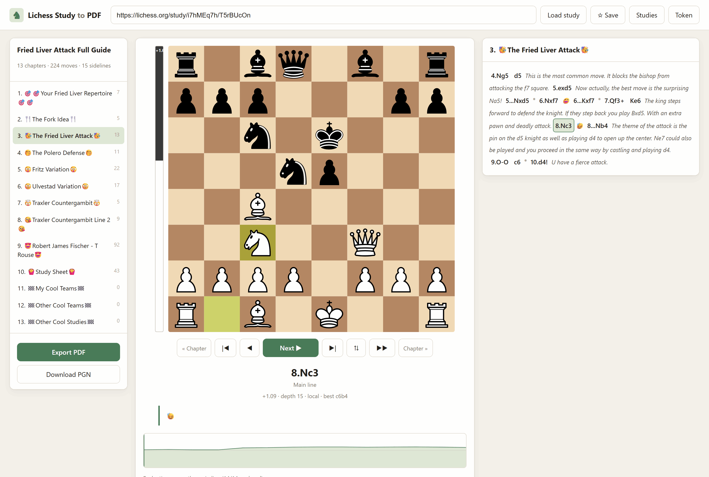
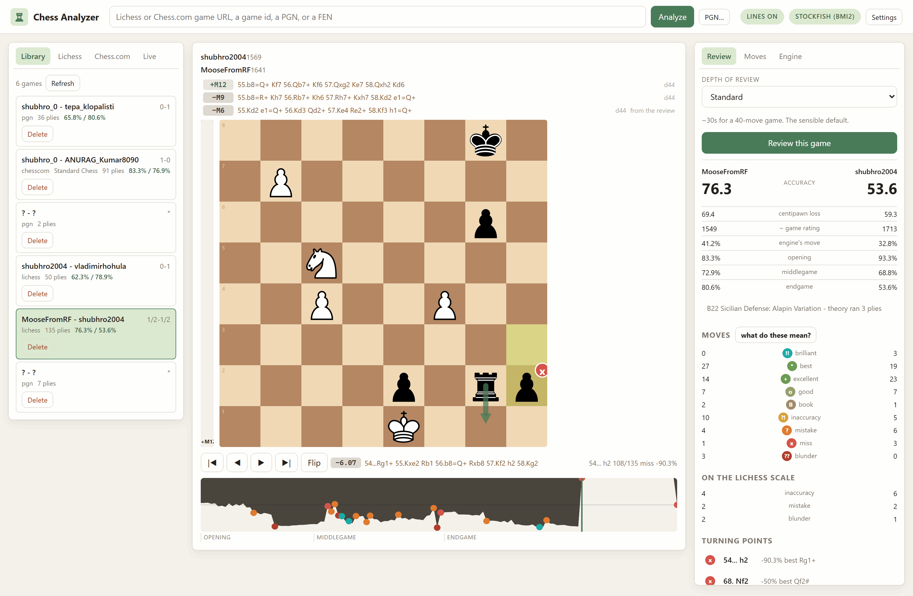
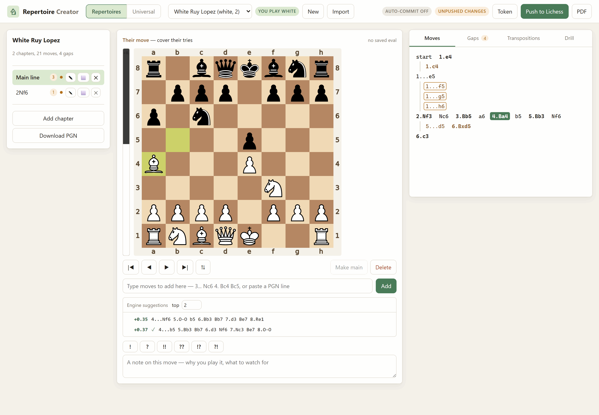

# Lichess Essentials

Tools that fix the things I keep running into as a long-time Lichess user.
Built for my own use, open source in case they are useful to anyone else.

## Apps

| App | What it does |
|---|---|
| [Lichess-Study-to-PDF](Lichess-Study-to-PDF/) | Turns a study into a typeset chess book or a step-through PDF — every sideline, comment and annotation included — plus a browser interface with a live engine eval bar and a board you can play your own moves on. Imports private studies without a token. |
| [ChessAnalyzer](ChessAnalyzer/) | Review any game with a local engine — from Lichess, from Chess.com, or from a PGN you paste. Accuracy and move labels on both the Lichess and a Chess.com-style scale, with the rules for every label written down and shown in the app. Eval graph, ranked engine lines, mouse-wheel stepping, and a live mode that follows a game while it is still being played — including Chess.com live games, which no documented API exposes. Or arrange the pieces by hand for a game happening in front of you, say who is to move, and get the evaluation. |
| [Player-Prepper](Player-Prepper/) | Scout an opponent from their own games, on either site. What they play per colour, where their own results say they leak points, and — measured against your repertoire, a study or your own games — every position they steer into that you have no answer for, ranked by how many of their games would put you there. Its exploit tab crosses their habits with what the engine says you get, on an opportunity score whose factors you switch on and off. Playable board with a live eval bar, and it prints the lot as a prep sheet. |
| [Repertoire-Creator](Repertoire-Creator/) | Build an opening repertoire locally — play or type the lines, annotate them, live eval bar and ranked engine suggestions — then publish it to Lichess as a study, drill yourself on it, or export it as a PDF. Knows which side you play, so it finds the positions you have no answer for. Its universal mode drops the chapters entirely: record sequences, and everything you have written down becomes one book keyed by position that tells you your own move as you play, or says *gap*. Saves to disk as you type and can commit and push itself. |

### What they look like

**[Lichess-Study-to-PDF](Lichess-Study-to-PDF/)** — a study open in the browser:
chapters down the left, a live engine eval beside the board, and every sideline,
comment and annotation in the notation panel.



**[ChessAnalyzer](ChessAnalyzer/)** — a finished review: the engine's ranked lines
above the board, the move's label on its own square with the engine's preferred move
drawn beside it, the eval graph underneath, and the report on the right.



**[Player-Prepper](Player-Prepper/)** — a scout of a real opponent: their
record and your coverage across the top, the gaps ranked by how many of their
games reach each one, and the selected gap with the engine's suggestion on it.


**[Repertoire-Creator](Repertoire-Creator/)** — a repertoire being written: the move
tree on the right, ranked engine suggestions under the board with a tick against the
moves you already have, and the gap count in the tab bar.




## Setup, once

All apps share one virtualenv at the repository root:

```powershell
# Windows PowerShell
python -m venv .lichess
.\.lichess\Scripts\python.exe -m pip install -r Lichess-Study-to-PDF\requirements.txt
.\.lichess\Scripts\python.exe -m pip install -r Repertoire-Creator\requirements.txt
.\.lichess\Scripts\python.exe -m pip install -r ChessAnalyzer\requirements.txt
.\.lichess\Scripts\python.exe -m pip install -r Player-Prepper\requirements.txt
.\.lichess\Scripts\python.exe -m pip install -e Lichess-Study-to-PDF
```

```bash
# Git Bash on Windows
python -m venv .lichess
./.lichess/Scripts/python.exe -m pip install -r Lichess-Study-to-PDF/requirements.txt
./.lichess/Scripts/python.exe -m pip install -r Repertoire-Creator/requirements.txt
./.lichess/Scripts/python.exe -m pip install -r ChessAnalyzer/requirements.txt
./.lichess/Scripts/python.exe -m pip install -r Player-Prepper/requirements.txt
./.lichess/Scripts/python.exe -m pip install -e Lichess-Study-to-PDF

# macOS / Linux
python -m venv .lichess
./.lichess/bin/python -m pip install -r Lichess-Study-to-PDF/requirements.txt
./.lichess/bin/python -m pip install -r Repertoire-Creator/requirements.txt
./.lichess/bin/python -m pip install -r ChessAnalyzer/requirements.txt
./.lichess/bin/python -m pip install -r Player-Prepper/requirements.txt
./.lichess/bin/python -m pip install -e Lichess-Study-to-PDF
```

That last line installs the study exporter as a library, which is how
Repertoire-Creator and Player-Prepper get their engine ladder and their PDF
layouts instead of carrying a second copy of them.

## Start an app

Run each **from inside its own folder**:

```powershell
# Windows PowerShell
cd Lichess-Study-to-PDF
& "..\.lichess\Scripts\python.exe" -m lichess_study_pdf.cli serve      # port 8777

cd ..\Repertoire-Creator
& "..\.lichess\Scripts\python.exe" -m repertoire_creator.cli serve     # port 8778

cd ..\ChessAnalyzer
& "..\.lichess\Scripts\python.exe" -m chess_analyzer.cli serve         # port 8779

cd ..\Player-Prepper
& "..\.lichess\Scripts\python.exe" -m player_prepper.cli serve       # port 8780
```

```bash
# Git Bash on Windows
cd Lichess-Study-to-PDF   && ../.lichess/Scripts/python.exe -m lichess_study_pdf.cli serve
cd ../Repertoire-Creator  && ../.lichess/Scripts/python.exe -m repertoire_creator.cli serve
cd ../ChessAnalyzer       && ../.lichess/Scripts/python.exe -m chess_analyzer.cli serve
cd ../Player-Prepper      && ../.lichess/Scripts/python.exe -m player_prepper.cli serve

# macOS / Linux
cd Lichess-Study-to-PDF   && ../.lichess/bin/python -m lichess_study_pdf.cli serve
cd ../Repertoire-Creator  && ../.lichess/bin/python -m repertoire_creator.cli serve
cd ../ChessAnalyzer       && ../.lichess/bin/python -m chess_analyzer.cli serve
cd ../Player-Prepper      && ../.lichess/bin/python -m player_prepper.cli serve
```

Then open <http://127.0.0.1:8777>, <http://127.0.0.1:8778>,
<http://127.0.0.1:8779> or <http://127.0.0.1:8780>. `Ctrl+C` stops any of
them.

Optional but worth it: a [Stockfish](https://stockfishchess.org/download/)
binary in `Lichess-Study-to-PDF/engine/` gives the other three apps evaluation
bars and Player-Prepper its suggested move for a gap
(ChessAnalyzer can also download one for you from its engine picker), and a
LaTeX install (MiKTeX or TeX Live) unlocks the typeset chess-book export. Each
app's startup banner tells you whether it found them.

Publishing a repertoire to Lichess additionally needs an API token with the
`study:write` scope — see
[the Repertoire-Creator README](Repertoire-Creator/README.md#publishing-to-lichess).

Repertoire-Creator writes into `Repertoire-Creator/repertoires/`, which is
inside this repository, and it commits and pushes that folder for you by
default. Only that folder is ever committed. If this repository is public, that
publishes your opening preparation too — turn pushing off with the `git` pill in
the app, or point `REPERTOIRE_DIR` somewhere private.

Full instructions, the CLI reference and troubleshooting live in each app's own
README: [Lichess-Study-to-PDF](Lichess-Study-to-PDF/README.md),
[Repertoire-Creator](Repertoire-Creator/README.md),
[ChessAnalyzer](ChessAnalyzer/README.md),
[Player-Prepper](Player-Prepper/README.md).

Player-Prepper reads `Repertoire-Creator/repertoires/` and never writes to it,
so the two are safe to run side by side. Its own folder,
`Player-Prepper/prep/`, holds cached opponent games and saved reports and is
gitignored — a scouting report about a named person is not something to
publish by accident.

## Licence

MIT — see [LICENSE](LICENSE).
