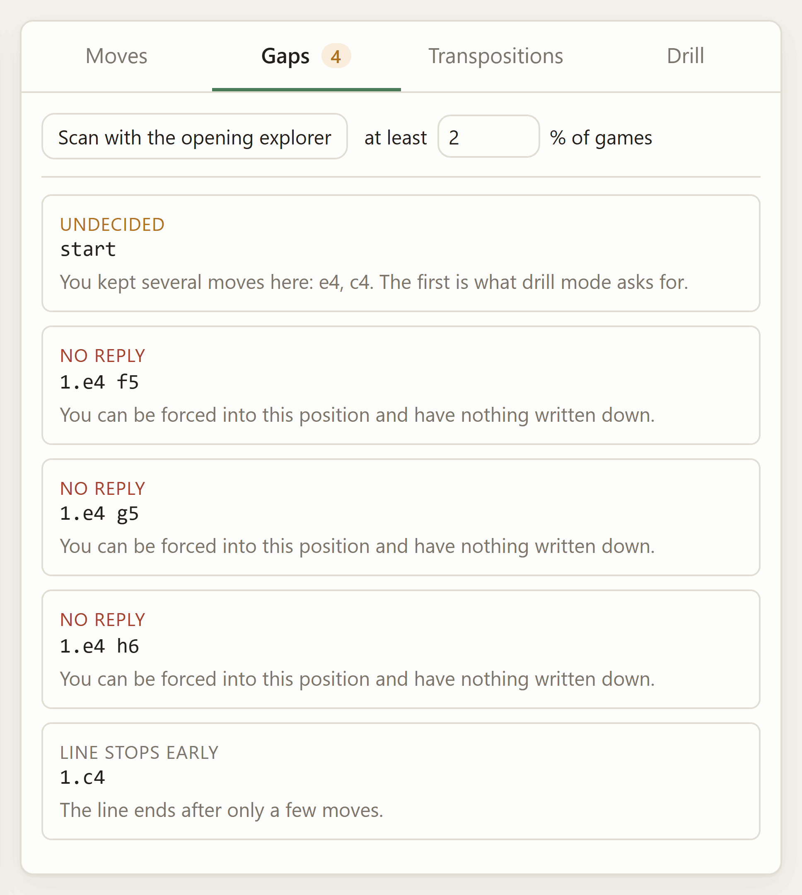
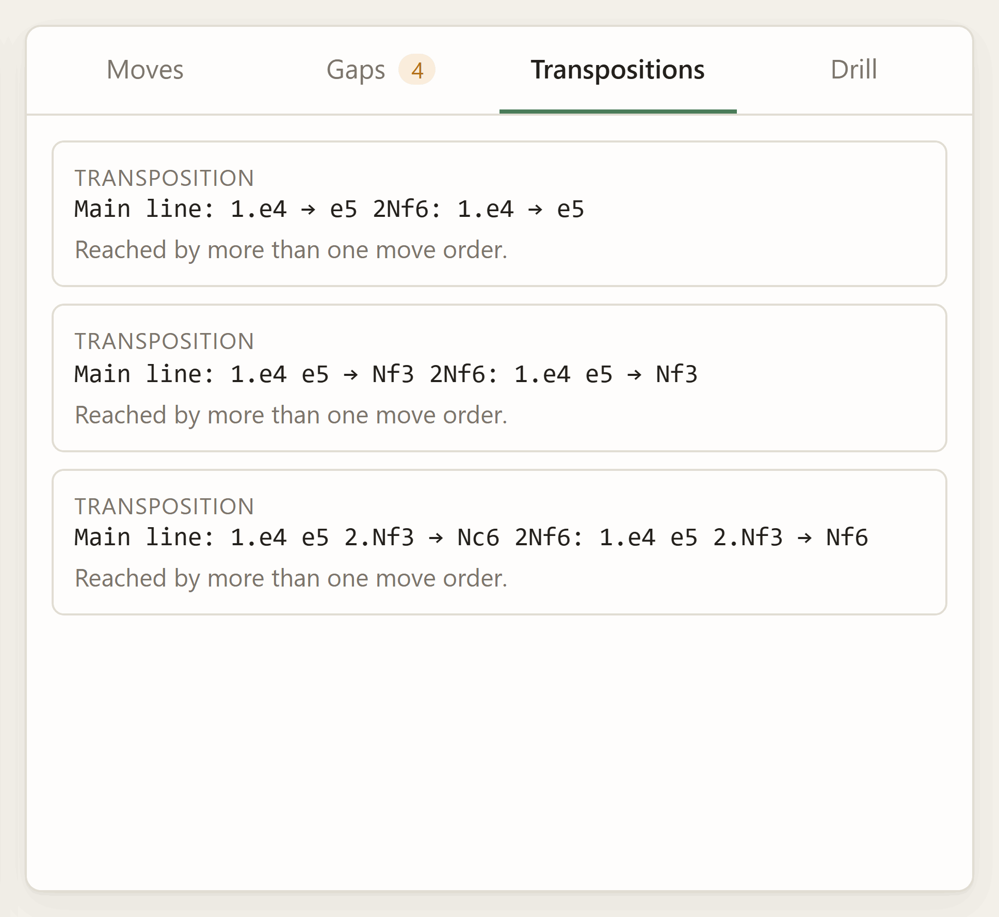
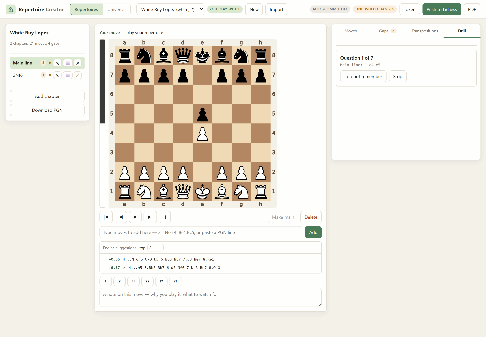
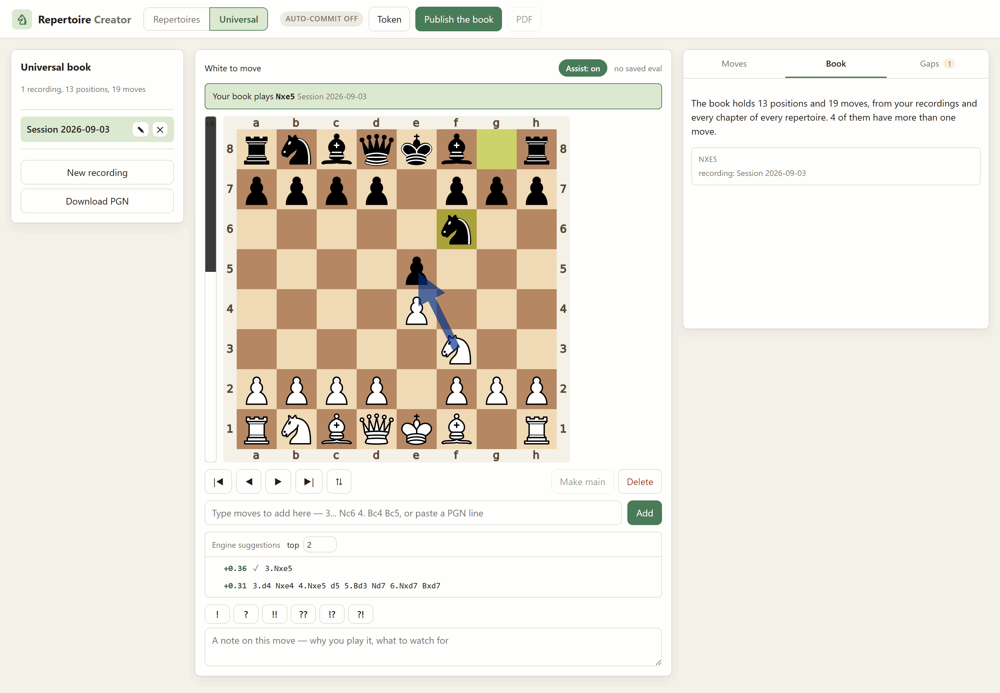

# Repertoire Creator

Build a chess opening repertoire on your own machine — play the moves in on a
board or type the notation, annotate them, watch a live engine eval bar as you
go — then publish the whole thing to Lichess as a study, or export it as a PDF.

It knows which side you play. That one fact is what turns a pile of variations
into a repertoire: it can tell you which positions you have no answer for,
which choices you never made, and which lines contradict each other — and it
can quiz you on your own moves.

```
Local PGN files  ──push──▶  Lichess study
      │                          │
      ├──▶ PDF export            └── shareable, works on your phone
      └──▶ drill mode
```


## What it does

| | |
|---|---|
| **Enter lines** | Click moves on the board, or paste notation (`1. e4 e5 2. Nf3`, nested variations and comments included). Playing a move you already have walks to it instead of duplicating it. |
| **Annotate** | Comments, `!`/`?`/`!!`/`??`/`!?`/`?!`, and Lichess's coloured circles and arrows — all stored in the PGN, all shown on Lichess after a push. |
| **Eval bar** | Live evaluation of whatever position you are looking at, and an `[%eval]` written into every saved move so the numbers survive into the file, the study and the PDF. |
| **Engine suggestions** | The top few moves here, ranked, with their lines. Two by default, up to five. A tick marks the ones you already have; clicking one plays it into your tree. |
| **Gaps** | Every position where it is your turn and you wrote nothing. Optionally, the opening-explorer scan: popular opponent replies you never answered. |
| **Transpositions** | The same position reached by two move orders — flagged loudly when your answer differs between them. |
| **Drill** | Spaced repetition over your own moves. The app plays the opponent; you have to find what you wrote. |
| **Universal mode** | No chapters. Record sequences as you play them, and everything you have ever written down — recordings and every chapter of every repertoire — becomes one book keyed by position. Turn the assist on and it tells you your own move as you walk, or says *gap*. |
| **Saves itself** | Every edit is written to disk as you make it, and optionally committed to git and pushed, so the repertoire survives the machine. |
| **Publish** | Create the Lichess study and push chapters into it. Pushing again updates those same chapters in place rather than duplicating them. |
| **PDF** | A typeset chess book, a contact sheet of diagrams, or a step-through slideshow — reusing the sibling app's exporter. |

Three of those tabs read the repertoire back to you rather than letting you
write into it, and each one is only possible because the app knows which side
you play:

| Gaps — every position where it is your turn and you wrote nothing, with a sentence saying why each one counts | Transpositions — the same position by two move orders, flagged loudly when your answers differ |
|---|---|
|  |  |

Drill is the third. The app plays the opponent and the board becomes a
question — you have to find what you wrote, and anything else counts as a miss
and comes back sooner:



## Setup

Everything shares the one virtualenv at the repository root. From the
repository root:

```powershell
# Windows PowerShell
python -m venv .lichess
.\.lichess\Scripts\python.exe -m pip install -r Repertoire-Creator\requirements.txt
.\.lichess\Scripts\python.exe -m pip install -e Lichess-Study-to-PDF
```

```bash
# Git Bash on Windows
python -m venv .lichess
./.lichess/Scripts/python.exe -m pip install -r Repertoire-Creator/requirements.txt
./.lichess/Scripts/python.exe -m pip install -e Lichess-Study-to-PDF

# macOS / Linux
python -m venv .lichess
./.lichess/bin/python -m pip install -r Repertoire-Creator/requirements.txt
./.lichess/bin/python -m pip install -e Lichess-Study-to-PDF
```

That second install is the sibling app, and it is what provides the engine
ladder and the PDF layout. Without it the editor still works, but there is no
eval bar and no PDF export; the startup banner tells you either way.

Two optional extras, both picked up automatically:

- a [Stockfish](https://stockfishchess.org/download/) binary in
  `Lichess-Study-to-PDF/engine/` — the eval bar and eval baking need it
- a LaTeX install (MiKTeX or TeX Live) — only for the typeset book export

## Run it

```powershell
# Windows PowerShell
cd Repertoire-Creator
& "..\.lichess\Scripts\python.exe" -m repertoire_creator.cli serve
```

```bash
# Git Bash on Windows
cd Repertoire-Creator
../.lichess/Scripts/python.exe -m repertoire_creator.cli serve

# macOS / Linux
cd Repertoire-Creator
../.lichess/bin/python -m repertoire_creator.cli serve
```

Open <http://127.0.0.1:8778>. `Ctrl+C` stops it.

### Keyboard and mouse

Scrolling the mouse wheel over the board steps through the line — down goes
forward, up goes back. Trackpads work too: a flick is one move, not ten.
During a drill the board is a question rather than a line, so the wheel scrolls
the page as usual.

| Key | |
|---|---|
| `←` `→` | back and forward through the line |
| `Home` `End` | start of the chapter, end of the current line |
| `F` | flip the board |
| `M` | make the current move the one you play (promote to main line) |
| `A` | toggle the assist (universal mode) |
| `Delete` | delete this move and everything after it |
| `Enter` in the move box | add the typed line |

## Universal mode

Chapters are a filing system, and a filing system is the wrong shape for the
question you ask at the board: *given this position, what do I play?* That
question does not care which chapter the answer was filed in, or by which move
order you arrived.

So switch to **Universal** in the top bar and there are no chapters. You make a
recording, play or paste a sequence, and it is saved as you go — as ordinary
PGN, one file per recording. Make another one tomorrow. Nothing needs
organising.

Underneath, everything you have ever written down is folded into one book keyed
by **position**: your recordings *and* every chapter of every repertoire. That
is what makes it answer correctly through transpositions — a reply you recorded
after `1.e4 e5 2.Nf3 Nc6 3.Bc4` is found when you arrive by `2.Bc4 Nc6 3.Nf3`,
because it is the same position.

Then turn on **Assist**. As you move, it tells you what your book plays here and
draws it on the board, and it distinguishes two kinds of silence:

- **Gap** — you reached this position through your own lines and there is
  nothing recorded from it. This is a hole in your preparation. Play the move
  you want and it is saved.
- **Outside your book** — no line of yours passes through this position at
  all, so there is nothing to be missing.

The engine's top lines sit under the board throughout, so a gap and the
engine's opinion of how to fill it are on screen together.

The **Book** tab shows what the book knows about the position you are on and
which recording or chapter each move came from. The **Gaps** tab lists every
place a recording runs out.



Universal mode is local by default. **Publish the book** merges the recordings
and splits them into one chapter per opening move, then pushes that as a study;
publishing again updates those same chapters. Chapters that came from a
repertoire are deliberately left out — publish those from the repertoire itself,
or Lichess ends up with two copies of the same preparation.

## Saving

Two layers, and the first is not optional.

**To disk, always, immediately.** There is no save button. Every move, comment
and annotation is written to its PGN file the moment you make it, through a
temporary file and an atomic rename. Kill the server mid-line and you lose
nothing.

**To git, if you want it.** The `git` pill in the top bar opens the settings.
When auto-commit is on, a save arms a timer — twenty seconds of quiet by
default — and then commits, so a burst of twenty moves is one commit and not
twenty. With push on as well, it pushes to your remote.

It commits **only the repertoires folder**, using an explicit pathspec, so
anything else you have in flight in the same repository is untouched — even
changes you have already staged. Git is run with terminal prompts disabled and
a hard timeout, so a missing credential fails visibly rather than wedging.
Failures show on the pill; hover it for the reason.

> **Worth knowing before you leave auto-push on:** the default data folder lives
> inside this repository, so pushing publishes your repertoire wherever that
> repository points. If the repo is public, so is your preparation — which for
> an opening repertoire may be exactly what you do not want. Turn push off in
> the git dialog and keep local commits, point `REPERTOIRE_DIR` at a private
> repository, or keep the repo private.

## Publishing to Lichess

You need a token with the **`study:write`** scope.
[Create one here](https://lichess.org/account/oauth/token/create?scopes[]=study:read&scopes[]=study:write&description=Repertoire%20Creator),
then either paste it into the app's **Token** dialog (kept in memory, forgotten
when the server stops), or make it permanent by saving it to
`~/.lichess_token` or setting `LICHESS_TOKEN`.

**Local is the source of truth.** A push makes the Lichess study look like the
folder on your disk. It never merges the other way, so anything you edited in
the browser on lichess.org is overwritten by the next push of that chapter.

What a push does, per chapter:

- **never pushed** → `import-pgn` creates it, and the Lichess chapter id is
  saved so next time it can be updated instead of duplicated
- **pushed before, changed since** → `/moves` replaces its move tree; the
  chapter keeps its id, its place in the study and any link you shared
- **pushed before, unchanged** → skipped, so pushing a 40-chapter repertoire
  after fixing one line costs one request

### What the Lichess API cannot do

Not this app's limitations — the API has no endpoint for them. You do these
by hand on lichess.org:

- rename a study, or change its visibility after it is created
- reorder chapters (the app orders them locally; a push does not move them)
- delete a study

Also enforced by Lichess: **64 chapters** per study, **30 new studies** per
day, and rate limiting on writes (the app paces itself about a second apart;
if you still get a 429, wait a full minute — retrying sooner extends it).

Two things I could not verify from the API documentation, so treat them as
best-effort rather than promises. Chapter *orientation* is a documented
parameter of `import-pgn`, and so is reliable when a chapter is first created;
on later pushes the app sends an `Orientation` tag through the tags endpoint,
but the docs do not say whether Lichess re-reads it to turn the board round.
Renaming is the same story — the new name goes up as a `ChapterName` tag, and
whether that renames the chapter or only its tags is not documented. If either
one does not take effect, fix it in the browser; nothing else about the push
depends on it.

The opening explorer now requires an authenticated request, so the gap scan
needs the same token — any scope will do for that part.

## Where your repertoire lives

Plain files, in `Repertoire-Creator/repertoires/` unless you point
`REPERTOIRE_DIR` or `--data` somewhere else:

```
repertoires/
  settings.json            git auto-commit settings, universal study id
  white-italian/
    repertoire.json        colour, chapter order, Lichess ids, push hashes
    drill.json             spaced-repetition state
    chapters/
      0001-main-line.pgn   ordinary PGN: variations, comments, NAGs, evals
      0002-two-knights.pgn
  universal/
    universal.json         the list of recordings
    recordings/
      0001-italian-session.pgn
```

Every chapter is a PGN file that any chess GUI will open, every write is
atomic, and the whole folder diffs cleanly in git. If you delete this app
tomorrow, your repertoire is still there and still readable.

## Command line

Everything the browser does is also a command, so a push or an export can go
in a script.

```bash
repertoire new "White — Italian" --color white
repertoire list
repertoire import https://lichess.org/study/abcd1234 --color black
repertoire report white-italian        # gaps, conflicts, counts
repertoire bake white-italian          # write engine evals into the PGN
repertoire push white-italian          # publish
repertoire pdf white-italian --mode book
repertoire token                       # check the token and its scopes
```

Run them through the venv the same way as `serve`, e.g.
`../.lichess/Scripts/python.exe -m repertoire_creator.cli report white-italian`.

## How the pieces fit

| Module | |
|---|---|
| `model.py` | the data model and move-tree helpers; a chapter *is* a `chess.pgn.Game` |
| `storage.py` | the folder layout, atomic writes, the manifest |
| `editing.py` | every mutation: play, paste, promote, annotate, merge |
| `analysis.py` | gaps, transpositions, counts |
| `explorer.py` | the opening-explorer scan for uncovered opponent replies |
| `universal.py` | recordings, the position-keyed book, and its export |
| `gitsync.py` | debounced commit and push of the repertoires folder |
| `drill.py` | question collection and the SM-2 schedule |
| `engine.py` | the live eval, the ranked suggestion lines, baking `[%eval]` |
| `lichess.py` | the API client, one method per endpoint |
| `sync.py` | push orchestration and importing an existing study |
| `export.py` | the bridge to the sibling app's PDF writers |
| `board.py` | board SVGs, drawn by python-chess |
| `server.py` / `web/` | the HTTP layer and the browser interface |

## Tests

```bash
../.lichess/Scripts/python.exe -m pytest tests -q
```

No network and no engine: the Lichess client is faked, so the sync logic —
which chapter is created, which is updated in place, which is skipped — is
covered without a token.

## Hosting it for free

Same profile as
[the sibling app](../Lichess-Study-to-PDF/README.md#hosting-it-for-free) —
FastAPI/Uvicorn needing a real container, not a serverless host — plus two
things that make this app's setup different:

1. **It needs the sibling package.** The eval bar and PDF export come from
   `pip install -e Lichess-Study-to-PDF` (see Setup, above), so the Docker
   build context has to be the **repository root**, not this folder.
2. **It writes your repertoire to disk, and free containers are ephemeral.**
   A redeploy — and possibly a wake from sleep, depending on the host — wipes
   anything not baked into the image. The fix is the git auto-commit this app
   already has (see "Saving", above), pointed at a dedicated GitHub repo
   instead of a folder inside this one.

[`Dockerfile`](Dockerfile) and [`entrypoint.sh`](entrypoint.sh) live in this
folder, same as any other app in this repo — but the build still has to run
with the **repository root** as its context, not this folder, so it can see
the sibling package. Docker keeps those two concerns separate: "where is the
Dockerfile" and "what can `COPY` see" are independent settings (the `-f` flag
to `docker build`), which is what Render's separate **Root Directory** /
**Dockerfile Path** fields below are for. Everything the Dockerfile `COPY`s
is written relative to that repo-root context, e.g.
`COPY Repertoire-Creator/requirements.txt ...`, which is why it looks a
little different from a Dockerfile that lives with its own self-contained
app. The one exception is `.dockerignore` — Docker always reads that from
the context root regardless of where the Dockerfile sits, so it stays at
[the repository root](../.dockerignore).

The entrypoint's rule is deliberately simple and never destructive: the
GitHub data repo wins once it has a single commit in it — every boot after
the first clones it fresh rather than trusting whatever is baked into the
image, and nothing here ever force-pushes.

### One-time: a private data repo

1. Create a new, **private** GitHub repo — e.g. `repertoire-data`. Leave it
   empty.
2. Generate a fine-grained Personal Access Token scoped to *only* that repo,
   with **Contents: Read and write** permission.
3. Build `https://<token>@github.com/<you>/repertoire-data.git`. This whole
   string is a secret: set it once as an environment variable on your host,
   never commit it, never paste it anywhere else.

### Render

1. Push this repo to GitHub.
2. **New Web Service** → connect the repo → **Root Directory**: leave blank
   (repo root, so the build context can see both apps) → **Dockerfile Path**:
   `Repertoire-Creator/Dockerfile` → **Free** instance.
3. Add environment variables, marked **secret**:
   - `REPERTOIRE_GIT_REMOTE_URL` — the token URL from above
   - `REPERTOIRE_AUTH_USER` / `REPERTOIRE_AUTH_PASS` — optional, see
     "Locking it behind a password" below
4. Deploy, and check the logs for the first-boot message about publishing
   seed data to the data repo — then confirm it landed in `repertoire-data`
   on GitHub.

### Hugging Face Spaces

Spaces are their own separate git repo, so:

1. **New Space** → **SDK: Docker** → **Hardware: CPU basic (free)**.
2. Clone the Space's repo locally. Copy in, preserving folder names:
   `Lichess-Study-to-PDF/` and `Repertoire-Creator/` (the latter already
   contains `Dockerfile` and `entrypoint.sh`) — then copy
   `Repertoire-Creator/Dockerfile` up to the **Space repo's own root** as
   well, since (unlike Render) Spaces always build whatever is literally
   named `Dockerfile` at their repo root, with no separate path setting.
3. Add this to the top of the Space's `README.md`:
   ```yaml
   ---
   title: Repertoire Creator
   sdk: docker
   app_port: 7860
   ---
   ```
4. **Settings → Repository secrets**: the same environment variables as
   Render, above.
5. Commit and push (a Hugging Face access token as the git password).

### Locking it behind a password

[`server.py`](repertoire_creator/server.py) has an HTTP Basic Auth gate that
only activates when both `REPERTOIRE_AUTH_USER` and `REPERTOIRE_AUTH_PASS`
are set — leave them unset and local `repertoire serve` is unaffected. Set
both as secrets on whichever host you use and every route, API included,
asks for that username and password before responding. It is one
shared credential pair, not per-user accounts, sent over the HTTPS both
Render and Hugging Face Spaces terminate by default on their `*.onrender.com`
/ `*.hf.space` domains.

### `LICHESS_TOKEN` on a public deployment

Same caveat as "Saving" and "Publishing to Lichess" above, restated for
hosting specifically: don't set it as an environment variable on a public
deployment. It would be shared by every visitor, letting anyone with the URL
publish to or read from whatever your token can access. Paste a token into
the UI per session instead.

## Troubleshooting

**"Position evaluation is unavailable"** — the sibling app is not installed.
`pip install -e Lichess-Study-to-PDF` from the repository root.

**The eval bar never moves** — no Stockfish. Drop a binary into
`Lichess-Study-to-PDF/engine/` and restart; the banner confirms it on startup.

**A push says HTTP 401 or 403** — the token is missing the `study:write`
scope, or you are not the owner or a contributor on that study. `repertoire
token` prints which scopes the token actually has.

**A push created a second copy of a chapter** — that chapter had no recorded
Lichess id, which happens if you created it on lichess.org rather than here.
Delete the duplicate on Lichess; the local one now holds the id it created.

**The git pill says "git problem"** — hover it for the reason. The usual ones
are no remote called `origin`, credentials git cannot supply without a prompt
(it is run with prompts disabled on purpose), or a non-fast-forward push
because the remote moved. The commit itself will have succeeded; only the push
failed, and nothing is lost either way.

**The gap scan returns nothing** — the explorer needs a token, and it only
reports moves above your threshold with enough games behind them. Lower the
percentage in the Gaps tab.
