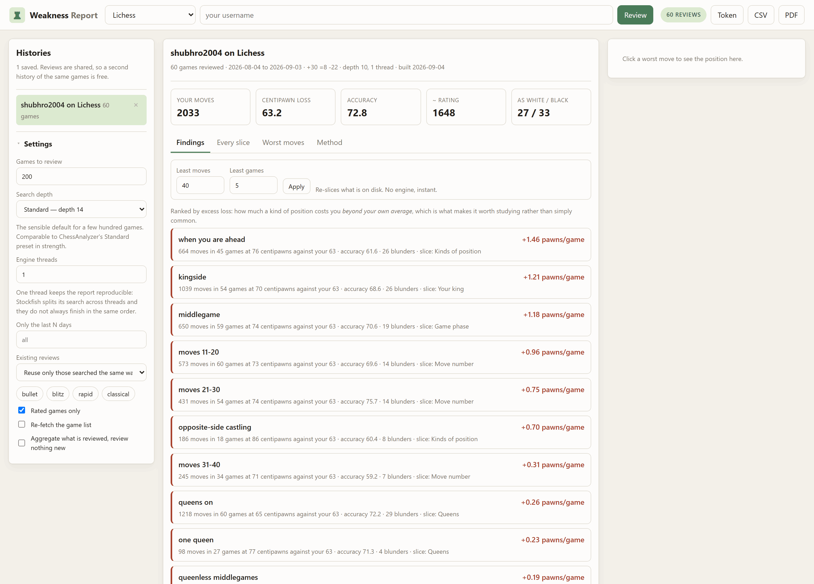
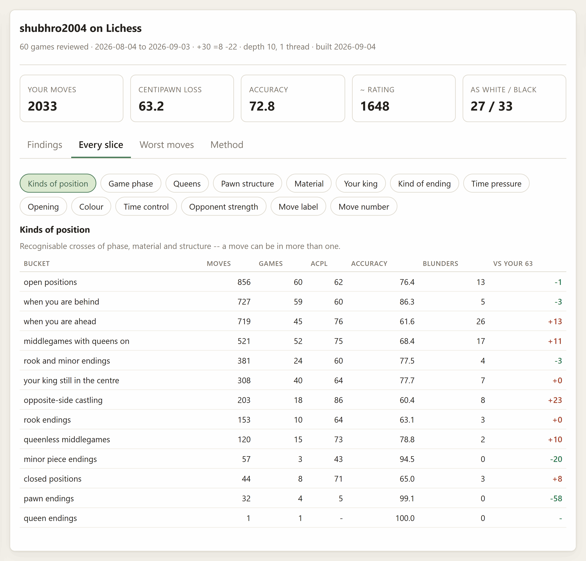
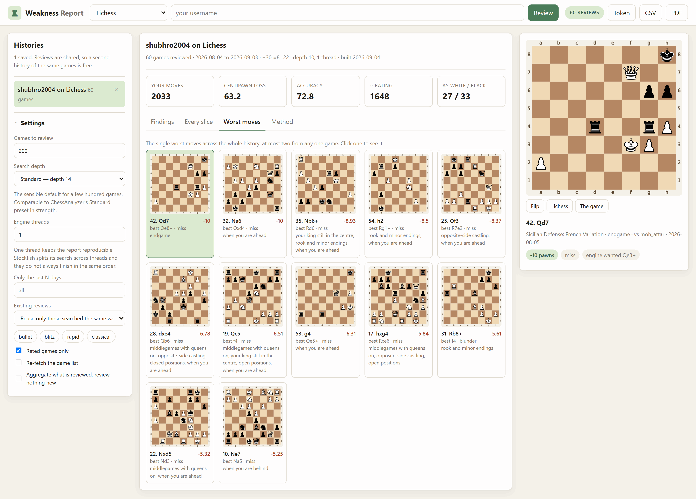
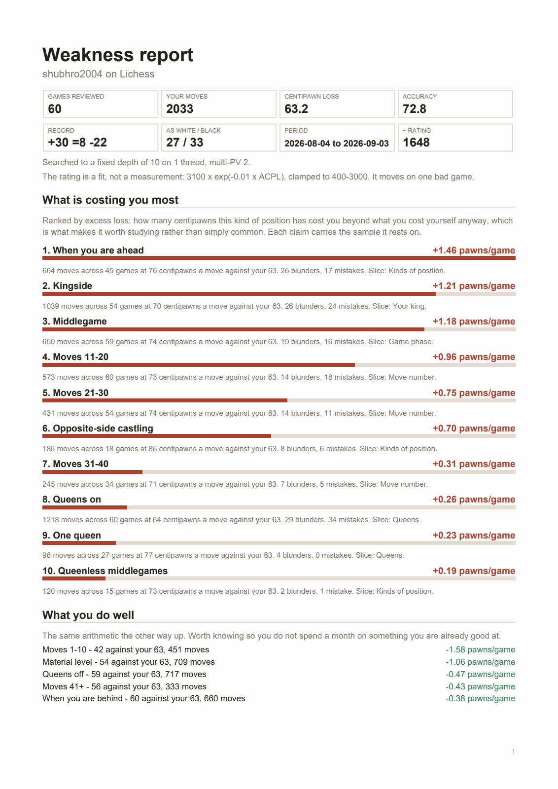
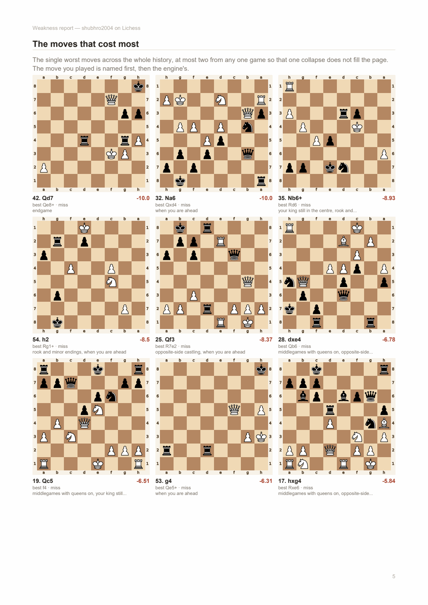
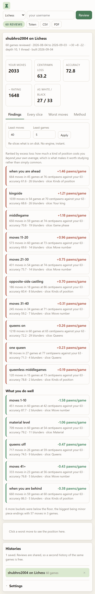

# Weakness Report

Review your whole game history and find out what you are actually bad at.

A single game review tells you what went wrong in that game. Four hundred of
them, sliced by the kind of position you were in, tell you what keeps going
wrong — which is the thing you can do something about:

> **When you are ahead** — 1.46 pawns a game worse than your average, over 664
> moves in 45 games (76 centipawns a move against your 63).

```powershell
cd Weakness-Report
& "..\.lichess\Scripts\python.exe" -m weakness_report.cli serve    # port 8781
```

Then open <http://127.0.0.1:8781>.



---

## The number the whole thing rests on

Three ways of ranking a slice, and only one of them answers "what should I
work on".

| Rank by | What you get |
|---|---|
| **Rate** (bucket ACPL) | Whichever bucket is smallest. Eleven moves in opposite-side castling at 300 centipawns beats everything, for ever. |
| **Total loss** (centipawns given away) | The middlegame, every time, because that is where most of your moves are. It is true and it is useless. |
| **Excess loss** | `moves × (bucket ACPL − your overall ACPL)`. How much a kind of position costs you **beyond what you cost yourself anyway**. |

Excess is the one this report ranks by, because it multiplies *how bad you are
at something* by *how often it happens to you*. Divided by the number of
games, it becomes the sentence you actually want: **0.4 pawns a game more than
your average, in queenless middlegames**.

Two guards sit in front of it:

- **A sample floor.** Nothing is claimed below 40 counted moves across 5
  games. Buckets under the floor stay in the tables, with their counts, so you
  can see what was set aside. Both numbers are adjustable in the browser, and
  changing them costs no engine time at all.
- **Deduplication by moves, not by names.** "Middlegame", "queens off" and
  "queenless middlegames" can be the same two hundred moves; ranked naively
  your top three findings are one finding three times. Findings are chosen
  greedily and anything that shares most of its *actual move set* with
  something already said is dropped. The comparison is Jaccard similarity, not
  containment — containment would throw away every specific finding in favour
  of the vague one that happens to contain it.

---

## Where the review comes from

**There is one implementation of "was that a blunder", and it is not in this
app.** Accuracy, the move labels, where the opening stops and the middlegame
starts, the engine pool — all of that is ChessAnalyzer's, tuned and written
down in that app's README. This app aggregates it.

That is a deliberate choice, and it is the reason a figure here means exactly
what the same figure means over there. A second implementation would drift,
and a report whose numbers disagree with the app you check them in is worse
than no report.

It is found automatically, in this order:

1. `chess_analyzer` already installed (`pip install -e ChessAnalyzer`)
2. `$CHESS_ANALYZER_DIR`, for a checkout somewhere unusual
3. **the sibling folder in this repository**, added to `sys.path` — the same
   trick ChessAnalyzer's own test suite uses on itself

Because of (3) a normal checkout needs no install at all. The startup banner
says which route it took. If it cannot be found, the app says so plainly and
refuses to invent a second opinion.

There is a test — `test_our_accuracy_matches_the_analyzers_exactly` — that
fails the moment the two could disagree.

### What this app does change

Two settings, both about making a report you can **run again in three months
and believe the difference**:

- **Fixed depth, not movetime.** ChessAnalyzer's presets are movetime budgets,
  which is right for one game you are reading move by move — that app says so
  itself about its own presets. It is wrong for a number averaged over four
  hundred games, because every figure would then depend on how busy the
  machine was. Batches here search to a fixed depth.
- **One engine thread by default.** Stockfish splits its search across threads
  and they do not always finish in the same order, so multi-threaded search is
  non-deterministic *even at a fixed depth*. One thread is slower and gives the
  same answer twice.

Both are settings; trade either away for speed if you would rather.

| Preset | Depth | Roughly |
|---|---|---|
| Sweep | 10 | ~1 second per 10 moves. Finds blunders and big patterns. |
| Standard | 14 | The sensible default for a few hundred games. |
| Deep | 18 | Several times slower. Worth it for a history you intend to keep. |

Sixty games at Sweep took 65 seconds on the machine this was written on.
The estimate in the app is deliberately crude and labelled as such: engine
speed varies by an order of magnitude across machines.

---

## Setting up

Everything shares the one virtualenv at the repository root:

```powershell
# Windows PowerShell
python -m venv .lichess
.\.lichess\Scripts\python.exe -m pip install -r Weakness-Report\requirements.txt
.\.lichess\Scripts\python.exe -m pip install -e Lichess-Study-to-PDF
```

```bash
# Git Bash on Windows
python -m venv .lichess
./.lichess/Scripts/python.exe -m pip install -r Weakness-Report/requirements.txt
./.lichess/Scripts/python.exe -m pip install -e Lichess-Study-to-PDF

# macOS / Linux
python -m venv .lichess
./.lichess/bin/python -m pip install -r Weakness-Report/requirements.txt
./.lichess/bin/python -m pip install -e Lichess-Study-to-PDF
```

The study exporter is optional and buys the board diagrams in the PDF, plus
the font handling that lets it draw them. ChessAnalyzer needs no install as
long as its folder is beside this one.

A [Stockfish](https://stockfishchess.org/download/) binary in
`Lichess-Study-to-PDF/engine/` is what does the actual reviewing; ChessAnalyzer
can also download one from its own engine picker. Without an engine there is
nothing to review.

**No API token is needed.** Every endpoint is public. A Lichess token raises
the rate limit while pulling a few hundred games; paste one into the Token
dialog and it is kept in memory for that session only, never written to disk.

---

## Running it

```powershell
# Windows PowerShell
cd Weakness-Report
& "..\.lichess\Scripts\python.exe" -m weakness_report.cli serve
```

```bash
# Git Bash on Windows
cd Weakness-Report
../.lichess/Scripts/python.exe -m weakness_report.cli serve

# macOS / Linux
cd Weakness-Report
../.lichess/bin/python -m weakness_report.cli serve
```

Open <http://127.0.0.1:8781>. `Ctrl+C` stops it. `--port 8782` if 8781 is
taken; `--host 0.0.0.0` exposes it to your network, which has no
authentication unless you set the password gate below — and this app serves
your own games and your own numbers, so only do that on a network you trust.

A review of a few hundred games takes minutes, not seconds. It runs in the
background, reports progress, survives you switching tabs, and can be
cancelled; anything already reviewed is kept, so a cancelled run is not a
wasted one.

---

## Where the games come from

| Source | |
|---|---|
| **Lichess** | One streaming request, PGN and clocks included. |
| **Chess.com** | Monthly archives, newest first, until there are enough. Bounded at 36 months. |
| **A PGN file or folder** | Anything you exported from anywhere, including games played over the board. |
| **ChessAnalyzer's library** | Games you have already reviewed there. Read only — this app never writes into another app's folder. |

Reviews are filed **by game id, not by dataset**, so the same game reviewed
once counts for every report that includes it, whichever door it came through.
Adding fifty games to a history of four hundred costs fifty reviews.

A saved review is only reused when it was searched **the same way**. Changing
the preset re-reviews rather than quietly mixing depth-10 and depth-18 numbers
into one average — a report that did that would look completely normal and be
entirely wrong. *Existing reviews* in the settings relaxes this if you would
rather have the speed, and the report then says its settings were mixed.

---

## How it slices your history

Fourteen dimensions, and a move can be in several buckets of the same one.

| | |
|---|---|
| **Kinds of position** | Queenless middlegames, middlegames with queens on, opposite-side castling, your king still in the centre, open and closed positions, rook / pawn / minor-piece / opposite-bishop endings, when you are ahead, when you are behind. A curated list rather than a full cross product: phase × queens × centre × material is 108 buckets, nearly all too small to say anything about. |
| **Game phase** | Opening, middlegame, endgame — boundaries found from the position, not a fixed move number. |
| **Queens, pawn structure, material, your king, kind of ending** | The raw position features, each computable from a FEN alone and each written out in the glossary. |
| **Time pressure** | Seconds left on your clock when you moved, from the PGN's own `[%clk]` comments. Games with no clock are left out of this slice entirely rather than lumped together. |
| **Opening** | Grouped by family, so a variation does not become its own bucket of one game. |
| **Colour, time control, opponent strength** | As White or Black, bullet through classical, and against players rated 100 points either side of you. |
| **Move label, move number** | How the move was labelled, and ten-move bands, which sometimes shows a slump the phase split hides. |



Every table shows moves, games, ACPL, accuracy, blunders and the gap to your
own average, so you can disagree with the ranking and read the numbers
yourself.

### What the features mean

All of them are computed from the position alone, and all are deliberately
simple, because a feature nobody can check is a feature nobody should trust:

- **queens off / one queen / queens on** — who still has a queen
- **open / semi-open / closed centre** — pawn pairs standing head to head:
  none, one or two, three or more
- **material ahead / level / behind** — a pawn or more either way, **from your
  side**, not White's
- **your king** — which wing it is standing on, counted only once the opening
  is over, because before that the bucket is really "have you castled yet"
- **rook / pawn / minor piece / opposite bishops / queen ending** — by which
  pieces are left, and only once the position is actually an ending

### An honest limit

Slices overlap and none of them is controlled for the others. A bucket that
happens to hold most of your middlegame will inherit how you play middlegames.
Near-duplicates are dropped, but a partial overlap survives — so read two
findings that cover the same moves as one observation, not two. The report
says this on its method page too.

---

## The worst moves

The single moves that cost most across the whole history, at most two from any
one game so that one collapse does not fill the page. Forced moves are
excluded: there was nothing else to play.



---

## Exporting

**PDF** is a document rather than a dump: what was measured and how, the
findings in order, what you do well, every slice as a table with a bar against
your average, the worst moves as diagrams, and the method. This is the new
layout — the study exporter lays out *lines of chess*, and a weakness report is
a different shape — but it borrows that app's board renderer for the diagrams
and its font handling, both optional.

 

**CSV** gives every bucket of every slice as one file, with the dimension as a
column, for anyone who would rather sort by their own column.

---

## On a phone

One column below 860px, with the report first, then the position you tapped,
then the history list and settings. Settings collapse into a fold, the tab bar
scrolls, and the board is never allowed to fill a tablet.



---

## What is kept on disk

```
history/                           (WEAKNESS_DIR, or ./history)
  settings.json
  games/lichess-you.json           the games of one dataset, PGN included
  reviews/lichess-Wi8IPxc3.json    one review per game -- the expensive part
  reports/lichess-you.json         the finished aggregation
  data/positions.json              the engine's position cache
```

Reviews are the only thing here that is expensive, and forgetting a report
keeps them. The position cache is this app's own rather than ChessAnalyzer's:
sharing that file would be a write into another app's folder, which the apps in
this repository do not do to each other.

`history/` is gitignored — it holds your games and a page of numbers about
your play.

---

## Command line

Reviewing four hundred games is the sort of thing you start before going to
bed, so everything the browser does is also a command, and the long one prints
progress rather than sitting silent for an hour.

```bash
weakness run <username> --source lichess --limit 300 --preset standard
weakness run you --source chesscom --speed blitz --days 180
weakness run me --source pgn --path ~/games/otb.pgn
weakness run me --source analyzer                # reuse ChessAnalyzer's reviews
weakness estimate <username> --preset deep       # how long would that take?
weakness games <username> --limit 500            # fetch only, review nothing
weakness show <key> --slice situation --slice clock
weakness reslice <key> --min-moves 80 --min-games 10
weakness list
weakness forget <key>                            # the report; reviews are kept
weakness pdf <key> --out report.pdf
weakness csv <key> --out slices.csv
weakness serve [--host H] [--port P]
```

Run them through the venv the same way as `serve`, e.g.
`../.lichess/Scripts/python.exe -m weakness_report.cli list`.

---

## How the pieces fit

| Module | |
|---|---|
| `bridge.py` | finding ChessAnalyzer and the study exporter, and degrading honestly without them |
| `sources.py` | your games in, from a site, a PGN, or ChessAnalyzer's library |
| `store.py` | the history folder; reviews filed per game so nothing is done twice |
| `batch.py` | the review driver: fixed depth, resumable, cancellable, settings-checked |
| `features.py` | what kind of position this is, from a FEN alone |
| `buckets.py` | every way the report cuts your history, in one place |
| `aggregate.py` | ACPL, accuracy and excess loss — ChessAnalyzer's definitions, unchanged |
| `findings.py` | buckets into ranked claims, deduplicated by the moves they cover |
| `report.py` | the whole document as one object |
| `pipeline.py` | fetch, review, aggregate, save — shared by the CLI and the server |
| `pdf.py` | the new layout |
| `exportcsv.py` | every slice as one spreadsheet |
| `board.py` | board diagrams for the browser |
| `jobs.py` | background work with progress and cancellation |
| `server.py` / `web/` | the HTTP layer and the browser interface |
| `cli.py` | the same operations as commands, for the overnight run |

`aggregate.py` and `findings.py` are pure: no network, no engine, no disk.
That is what makes the evidence floor adjustable in the browser — re-slicing
four hundred games is milliseconds.

## Tests

```bash
../.lichess/Scripts/python.exe -m pytest tests -q          # 42 tests
```

No network, no engine, no Stockfish. Four of them exist because of a specific
quiet failure this app is built to avoid:

- **`test_a_review_at_other_settings_is_not_reused`** — a depth-10 review
  inside a depth-18 batch produces a normal-looking report with every figure
  wrong.
- **`test_a_specific_bucket_survives_being_inside_a_vague_one`** — the overlap
  check was written with containment first, which silently threw away every
  specific finding in favour of the vague bucket holding it. A test caught it;
  the fix was Jaccard similarity.
- **`test_acpl_excludes_book_moves`** — ChessAnalyzer excludes them, and a
  report that did not would flatter anyone with preparation.
- **`test_no_rule_stretches_a_checkbox_across_its_container`** — the one
  stylesheet assertion, and it is here because `.dialog input` and
  `.check input` have identical specificity, so whichever was written last
  won. The later one set `width: 100%`, which turned each checkbox in the
  export dialog into a full-width slab that shouldered its own label out
  through the right-hand edge. Nothing in Python could see it and the
  stylesheet reads correctly. The rule now says `:not([type="checkbox"])`
  outright, and the test asks the general question — does any selector setting
  `width: 100%` still reach a bare `input` — so it keeps holding for rules
  nobody has written yet.

Two more were written wrong before the code was: a test assumed a rare
disaster must outrank a common leak, and the arithmetic says it depends on the
product. That is the intended behaviour, and it is now an assertion rather
than an assumption.

---

## Hosting it for free

Same profile as the other four apps — FastAPI/Uvicorn needing a real
container, not a serverless host. This one needs **two** siblings, so the
Docker build context has to be the **repository root**.

[`Dockerfile`](Dockerfile) lives here but must be built with the repo root as
its context. Docker keeps "where is the Dockerfile" and "what can `COPY` see"
separate, which is what Render's **Root Directory** and **Dockerfile Path**
fields are for. It installs Stockfish via `apt-get` and installs ChessAnalyzer
as a package, so there is still exactly one implementation of the review in the
image.

**Reviewing on a free container is a bad idea** and worth saying plainly: a
shared vCPU searching to depth 14 is slow, and `history/` is wiped by every
redeploy, so the reviews — the expensive part — do not survive. Host it to
*read* reports if you like; review locally.

### Render

1. Push this repo to GitHub.
2. **New Web Service** → connect the repo → **Root Directory**: leave blank →
   **Dockerfile Path**: `Weakness-Report/Dockerfile` → **Free** instance.
3. Optional secrets: `WEAKNESS_AUTH_USER` / `WEAKNESS_AUTH_PASS`.
4. Deploy.

### Hugging Face Spaces

1. **New Space** → **SDK: Docker** → **CPU basic (free)**.
2. Clone the Space's repo and copy in `Lichess-Study-to-PDF/`,
   `ChessAnalyzer/` and `Weakness-Report/`, then copy
   `Weakness-Report/Dockerfile` to the Space repo's own root.
3. Add to the top of the Space's `README.md`:
   ```yaml
   ---
   title: Weakness Report
   sdk: docker
   app_port: 7860
   ---
   ```
4. **Settings → Repository secrets**: the same variables as Render.

### Locking it behind a password

[`server.py`](weakness_report/server.py) has an HTTP Basic Auth gate that only
activates when both `WEAKNESS_AUTH_USER` and `WEAKNESS_AUTH_PASS` are set, so
local use is never asked for credentials. Do **not** set `LICHESS_TOKEN` on a
public deployment: it would be shared by every visitor.

---

## If something goes wrong

| Symptom | Cause and fix |
|---|---|
| `No module named weakness_report` | You are in the wrong directory. `cd` into `Weakness-Report` first. |
| "ChessAnalyzer could not be found" | Keep its folder beside this one, set `CHESS_ANALYZER_DIR`, or `pip install -e ChessAnalyzer` from the repo root. |
| "No Stockfish found" | Put a binary in `Lichess-Study-to-PDF/engine/`, or download one from ChessAnalyzer's engine picker. |
| Nothing clears the evidence floor | Too few games. Review more, or lower *least moves* / *least games* — that re-slices instantly, no engine. |
| The report says settings were mixed | Some reviews came from another preset. Set *Existing reviews* to *ignore* and run again for a clean set. |
| Reviewing seems stuck | It is not: a few hundred games at depth 14 is genuinely tens of minutes. The progress bar counts games. Stop it and every finished review is kept. |
| A second run takes as long as the first | You changed the preset, so nothing could be reused. That is deliberate — mixing depths would silently corrupt every average. |
| The PDF has no diagrams | The study exporter is not installed. `pip install -e Lichess-Study-to-PDF`. |
| Lichess says 429 | You pulled a lot of games. Wait a minute; a token raises the limit. |

## Licence

MIT — see [LICENSE](../LICENSE). Chess piece artwork in the diagrams comes from
python-chess (Colin M.L. Burnett's Cburnett set, CC BY-SA 3.0); opening names
come from [lichess-org/chess-openings](https://github.com/lichess-org/chess-openings)
(CC0). The accuracy formula and move-label rules are ChessAnalyzer's, which
takes the published Lichess thresholds for the three Lichess judgments.
